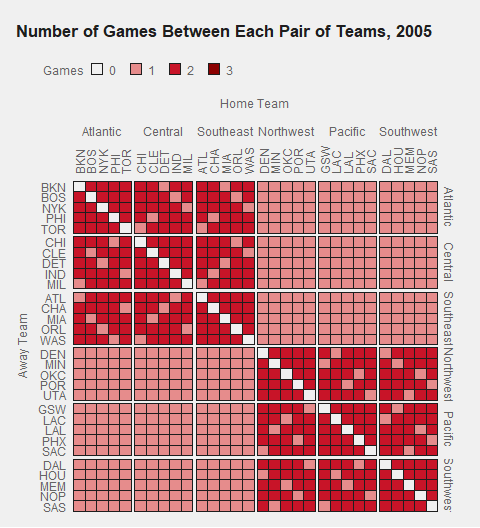
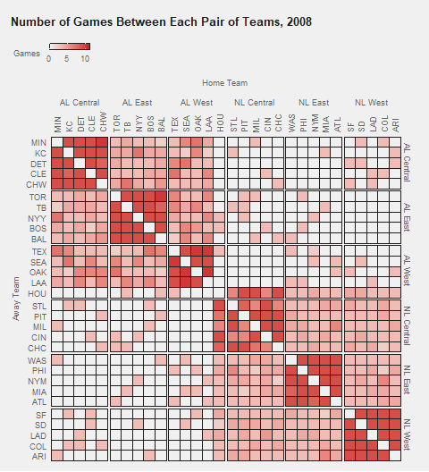

# Schedule data

Let's investigate a few aspects of schedule data, like how often teams play each other, how many days rest teams typically get, and how game outcomes are or are not affected by how many days rest teams get before playing their games. 

## Schedule matrix grid plot

Let's visualize how often teams play each other in a season. 

```{r fig.width=6, fig.height=7}
library(tidyverse)
library(pubtheme)
library(gganimate)

d = readRDS('data/games.rds')
dgm = d %>% 
  filter(lg=='nba', season %in% 2005:2022, season.type=='reg') %>%
  mutate(home = case_when(home=='NJN' ~ 'BKN', 
                          home %in% c('NOH', 'NOK') ~ 'NOP', 
                          home=='SEA' ~ 'OKC', 
                          TRUE ~ home), 
         away = case_when(away=='NJN' ~ 'BKN', 
                          away %in% c('NOH', 'NOK') ~ 'NOP', 
                          away=='SEA' ~ 'OKC', 
                          TRUE ~ away)) %>%
  group_by(away, home, season) %>%
  summarise(games = n()) %>%
  ungroup() %>%
  complete(away, home, season, fill=list(games=0)) %>% ## new function! 
  mutate(Games = as.character(games))
head(dgm)


dg = dgm %>% filter(season==2022)
title = "Number of Games Between Each Pair of Teams" 
g = ggplot(dg, aes(x=home, y=away, fill=Games))+ 
  geom_tile(linewidth=0.4, show.legend = T, color=pubdarkgray) + ## used char above so leg is discrete
  scale_fill_manual(values=c(pubbackgray, publightred, pubred)) +
  labs(title    = title,
       x = 'Home Team', 
       y = 'Away Team')+  
  scale_x_discrete(expand = c(0, 0), position='top')+
  scale_y_discrete(expand = c(0, 0)) +
  theme_pub(type='grid', base_size=36/3)+
  theme(axis.text.x.top = element_text(angle = 90, vjust = .5, hjust = 0), legend.key.width = )
g
```

## Order character vectors using `factor`

By default, R organizes the teams alphabetically. Instead of seeing teams alphabetically, we'll want to see them organized by division. So we'll use `factor` and specify the `levels` to be the order we want for both teams and divisions

```{r}
tms = read.csv('data/nba.teams.csv')
tms = tms %>% 
  arrange(conf, div) %>%
  mutate(conf = paste0(toupper(substr(conf,1,1)), substr(conf, 2, nchar(conf))),
         div  = paste0(toupper(substr(div ,1,1)), substr( div, 2, nchar( div))), 
         div  = factor(div, levels=unique(div)))
head(tms)

teams.order = tms %>% 
  select(team) %>% 
  unlist()
head(teams.order)

dgm = dgm %>%
  
  ## add columns for the division of home and away team
  left_join(tms %>% select(team, div), 
            by = c('home'='team')) %>%
  left_join(tms %>% select(team, div), 
            by = c('away'='team'), suffix=c('.h', '.a')) %>%
  
  ## specify order we want the teams in. This has to be done
  ## after the above code, because the above code turns
  ## `away` and `home` into character vectors
  mutate(away = factor(away, levels=rev(teams.order)), 
         home = factor(home, levels=teams.order))

head(sort(dg$home))
head(sort(dg$away))
```

## Schedule matrix, ordered by division

```{r fig.width=6, fig.height=7}
dg = dgm %>% filter(season==2022)
title = "Number of Games Between Each Pair of Teams" 
g = ggplot(dg, aes(x=home, y=away, fill=Games))+
  geom_tile(linewidth=0.4, show.legend = T, color=pubdarkgray) + ## used char above so leg is discrete
  scale_fill_manual(values=c(pubbackgray, publightred, pubred)) +
  labs(title    = title,
       x = 'Home Team', 
       y = 'Away Team')+  
  scale_x_discrete(expand = c(0, 0), position='top')+
  scale_y_discrete(expand = c(0, 0)) +
  theme_pub(type='grid', base_size=36/3)+
  theme(axis.text.x.top = element_text(angle = 90, vjust = .5, hjust = 0))
print(g)
```


## Schedule matrix, faceted by division

We can use `facet_grid` to create a new window for each pair of divisions. This creates a nice separation to help depict the structure of the data. 

```{r fig.width=6, fig.height=7}
title = "Number of Games Between Each Pair of Teams" 

g = ggplot(dg, aes(x=home, y=away, fill=Games))+
  geom_tile(linewidth=0.4, show.legend = T, color=pubdarkgray) + 
  facet_grid(div.a ~ div.h, scales='free')+ ## now faceting by division
  scale_fill_manual(values=c(pubbackgray, publightred, pubred)) +
  labs(title    = title,
       x = 'Home Team', 
       y = 'Away Team')+  
  scale_x_discrete(expand = c(0, 0), position='top')+
  scale_y_discrete(expand = c(0, 0)) +
  theme_pub(type='grid', base_size=36/4)+
  theme(axis.text.x.top = element_text(angle = 90, vjust = .5, hjust = 0), 
        
        ## we can adjust the panel spacing a little bit, if desired
        ## makes the legend look like squares instead of rectangles, if desired
        ## px is defined above. It is the length of one pixel in inches
        ## these are optional, wouldn't expect anyone to think of this
        panel.spacing     = unit(1/72*10/4, "in"), 
        legend.key.width  = unit(1/72*36/4, "in"),
        
        ## moves the title to the left a little bit, if desired
        legend.title = element_text(size=36/4, vjust=0.5, 
                                    margin = margin(0,  1/72*20/4,
                                                    0, -1/72*30/4, 'in')))
print(g)


```

## Schedule matrix faceted by season
Before creating the animation, let's look at the frames that will become the animation. 

```{r fig.height=6.5, fig.width=8}
base_size=12
px=1/72*base_size/36
dg = dgm ## all seasons, not just 2022
title = "Number of Games Between Each Pair of Teams, {next_state}"
g = ggplot(dg, aes(x=home, y=away, fill=Games))+
  geom_tile(linewidth=0.4, show.legend = T, color=pubdarkgray) + ## used char above so leg is discrete
  scale_fill_manual(values=c(pubbackgray, publightred, pubred, 'red4')) +
  labs(title    = title,
       x = 'Home Team', 
       y = 'Away Team')+  
  geom_vline(xintercept=1:(length(unique(dg$home ))+1)-.5, color=pubdarkgray, linewidth=0.2)+ # vert  lines between each square
  geom_hline(yintercept=1:(length(unique(dg$away))+1)-.5, color=pubdarkgray, linewidth=0.2)+ # horiz lines 
  scale_x_discrete(expand = c(0, 0), position='top')+
  scale_y_discrete(expand = c(0, 0)) +
  theme_pub(type='grid', base_size=36/3)+
  
  ## we can adjust the panel spacing a little bit, if desired
  ## and make the keys in the legend look more square
  theme(axis.text.x.top = element_text(angle = 90, vjust = .5, hjust = 0),
        panel.spacing     = unit(10*px, "in"), 
        legend.key.width  = unit(36*px, "in"))

## check that the frames look ok
g + 
  facet_wrap(~season, nrow=3) + 
  theme(axis.text=element_blank(), 
        axis.text.x.top = element_blank()) ## remove axis labels for this one
```


## Animated Schedule Matrix 
```{r}
## animation transitions
gg = g +
  transition_states(states = season, 
                    transition_length = 0,
                    state_length = 1, 
                    wrap=F)

# ## other animation settings
# a1 = animate(gg,
#         width = 1440/3,
#         height=1440/3*1.1,
#         fps = 1,
#         nframes=18+2,
#         start_pause=1,
#         end_pause=1)
# a1
# 
# # ## save the animation a1
# anim_save(a1, filename = 'img/nba.schedule.matrix.gif')
```



## Animated schedule matrix, MLB edition

```{r fig.height=7, fig.width=6}
dgm = d %>% 
  filter(lg=='mlb', season %in% 2005:2022, season.type=='reg') %>%
  mutate(home = case_when(home=='CWS' ~ 'CHW',
                          home=='WSH' ~ 'WAS',
                          TRUE ~ home), 
         away = case_when(away=='CWS' ~ 'CHW',
                          away=='WSH' ~ 'WAS',
                          TRUE ~ away)) %>%
  group_by(away, home, season) %>%
  summarise(games = n()) %>%
  ungroup() %>%
  complete(away, home, season, fill=list(games=0)) %>% ## new function! 
  mutate(Games = (games))
head(dgm)

tms = read.csv('data/mlb.teams.csv')
head(tms)
tms = tms %>% 
  arrange(conf, div) %>%
  mutate(conf = paste0(toupper(substr(conf,1,1)), substr(conf, 2, nchar(conf))),
         div  = paste0(toupper(substr(div ,1,1)), substr( div, 2, nchar( div))), 
         div  = paste(conf, div),
         div  = factor(div, levels=unique(div)))
head(tms)

teams.order = tms %>% 
  arrange(desc(team)) %>%
  select(team) %>% 
  unlist()
head(teams.order)

dgm = dgm %>%
  
  ## add columns for the division of home and away team
  left_join(tms %>% select(team, div), 
            by = c('home'='team')) %>%
  left_join(tms %>% select(team, div), 
            by = c('away'='team'), suffix=c('.h', '.a')) %>%
  
  ## specify order we want the teams in. This has to be done
  ## after the above code, because the above code turns
  ## `away` and `home` into character vectors
  mutate(away = factor(away, levels=rev(teams.order)), 
         home = factor(home, levels=teams.order))

dg = dgm #%>% filter(season==2022)
title = "Number of Games Between Each Pair of Teams, {next_state}" 
g = ggplot(dg, aes(x=home, y=away, fill=Games))+
  geom_tile(linewidth=0.4, show.legend = T, color=pubdarkgray) + 
  facet_grid(div.a ~ div.h, scales='free')+ ## now faceting by division
  scale_fill_gradient(low = pubbackgray, 
                      high = pubred, 
                      na.value = 'white',
                      oob = squish, 
                      breaks = c(0,5,10), 
                      guide = guide_colorbar(frame.colour = pubdarkgray)) +
  labs(title    = title,
       x = 'Home Team', 
       y = 'Away Team')+  
  scale_x_discrete(expand = c(0, 0), position='top')+
  scale_y_discrete(expand = c(0, 0)) +
  theme_pub(type='grid', base_size=36/4)+
  theme(axis.text.x.top = element_text(angle = 90, vjust = .5, hjust = 0), 
        
        ## we can adjust the panel spacing a little bit, if desired
        ## makes the legend look like squares instead of rectangles, if desired
        ## px is defined above. It is the length of one pixel in inches
        ## these are optional, wouldn't expect anyone to think of this
        panel.spacing     = unit(1/72*10/4, "in"), 
        legend.key.width  = unit(1/72*36/4, "in"),
        
        ## moves the title to the left a little bit, if desired
        legend.title = element_text(size=36/4, vjust=0.5, 
                                    margin = margin(0,  1/72*20/4,
                                                    0, -1/72*30/4, 'in')))


gg = g +
  transition_states(states = season, 
                    transition_length = 0,
                    state_length = 1, 
                    wrap=F)

## other animation settings
# a1 = animate(gg,
#         width = 1440/3,
#         height=1440/3*1.1,
#         fps = 1,
#         nframes=length(unique(dgm$season))+2,
#         start_pause=1,
#         end_pause=1)
# a1
# # 
# # # ## save the animation a1
# anim_save(a1, filename = 'img/mlb.schedule.matrix.gif')
```



## Days rest by team

```{r}
dd = dd %>%
  arrange(date) %>%
  group_by(team) %>%
  mutate(days.rest = c(NA, diff(date))) 
dd %>% filter(team=='PHI') %>% head()
```

```{r}
dg = dd %>%
  filter(season==2022) %>%
  mutate(days.rest = ifelse(days.rest>=3 | 
                              is.na(days.rest), '3 or more', days.rest)) %>%
  group_by(team, days.rest) %>%
  summarise(games = n()) %>% 
  group_by(days.rest) %>%
  mutate(max = max(games))
  
head(dg)
```

```{r fig.height=6, fig.width=6}
title = "Number of Games With Each Number of Days Rest" 

g = ggplot(dg, aes(x=games, y=team))+
  geom_bar(stat='identity', aes(x=max+10), color=NA, fill=publightgray, width=0.8)+ ## optional background bars. 
  geom_bar(stat='identity', fill=pubred, color=NA, width=0.8)+ 
  geom_text(aes(label=round(games,2)), hjust=-0.1, vjust=0.4)+ ## optional numbers with reasonable number of digits
  facet_wrap(~days.rest, scales='free')+
  labs(title    = title,
       x = NULL, ## Optional. 
       y = NULL)+  ## Optional. Upper Lower.
  #scale_x_continuous(limits=c(0,dg$max))+ 
  theme_pub(type='bar', base_size=36/4) 
print(g)
```


## Days rest and game outcomes
Let's explore the relationship between `days.rest` and game outcomes. 

```{r}
dr = dd %>%
  group_by(days.rest) %>%
  summarise(score = round(mean(score),2), 
            opp.score = round(mean(opp.score),2), 
            n = n()) %>%
  mutate(days.rest = factor(days.rest, levels=6:1)) %>%
  filter(!is.na(days.rest))
dr
```


```{r}
dr = dr %>% 
  mutate(max=150, 
         label = paste0(round(score,1), ' (n = ', n, ')'))

title = "Average Points Scored by Days Rest" 
g = ggplot(dr, aes(x=score, y=days.rest))+
  geom_bar(stat='identity', aes(x=max), color=NA, fill=publightgray, width=0.8)+ ## optional background bars. 
  geom_bar(stat='identity', fill=pubred, color=NA, width=0.8)+ 
  geom_text(aes(label=label), hjust=-0.1)+ ## optional numbers with reasonable number of digits
  labs(title    = title,
       x = 'Average Points Scored', ## Optional. 
       y = 'Days Rest')+  ## Optional. Upper Lower.
  scale_x_continuous(limits=c(0,150))+ 
  theme_pub(type='bar', base_size=36/3) 
print(g)
```
```{r}
dr = dr %>% 
  mutate(max=150, 
         label = paste0(round(opp.score,1), ' (n = ', n, ')'))

title = "Average Points Allowed by Days Rest" 
g = ggplot(dr, aes(x=opp.score, y=days.rest))+
  geom_bar(stat='identity', aes(x=max), color=NA, fill=publightgray, width=0.8)+ ## optional background bars. 
  geom_bar(stat='identity', fill=pubred, color=NA, width=0.8)+ 
  geom_text(aes(label=label), hjust=-0.1)+ ## optional numbers with reasonable number of digits
  labs(title    = title,
       x = 'Average Points Allowed', ## Optional. 
       y = 'Days Rest')+  ## Optional. Upper Lower.
  scale_x_continuous(limits=c(0,150))+ 
  theme_pub(type='bar', base_size=36/3) 
print(g)
```
