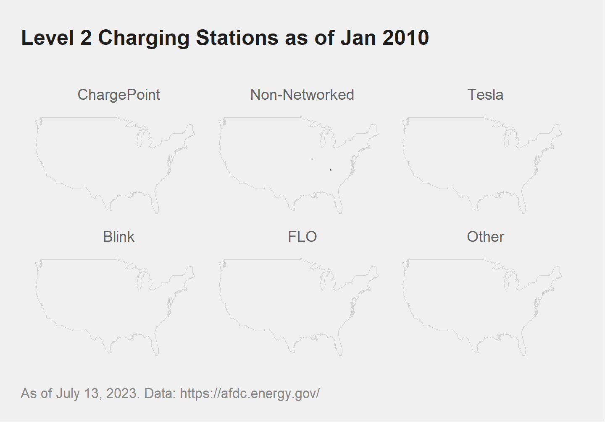
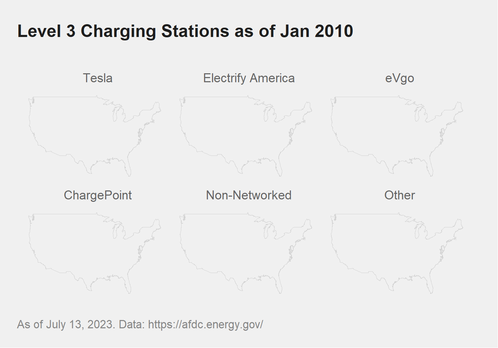

# Maps

## Charging Stations in US and Canada

```{r}
library(tidyverse)
library(pubtheme)
library(gganimate)
library(leaflet)
library(terra)

title = "Level 2 and Level 3 Charging Stations in US and Canada"
g = ggplot(d, 
           aes(x    = lon, 
               y    = lat, 
               size = lev23))+
  borders('state', 
          colour = publightgray)+
  geom_point(alpha = .1, 
             color = pubred, 
             show.legend = F)+
  labs(title = title)
  

g %>% 
  pub(type = 'map')
```

## Level 2 and Level 3 stations

```{r fig.width=8, fig.height=3.5}
dg = d %>% 
  pivot_longer(cols = c(lev2, lev3)) %>%
  filter(value != 0) %>%
  mutate(name = ifelse(name == 'lev2', 
                       'Level 2', 
                       'Level 3'))

title = "Level 2 and Level 3 Charging Stations in US and Canada"

g = ggplot(dg, 
           aes(x     = lon, 
               y     = lat, 
               size  = value, 
               color = name))+
  borders('state', 
          colour = publightgray)+
  geom_point(alpha = .1, 
             show.legend = F)+
  facet_wrap(~name)+
  labs(title = title)
  
g %>% 
  pub('map') + 
  scale_size(range = c(.75, 3))
```


## Level 2 Charging Stations by Network

```{r fig.height=5, fig.width=8}
dg = d %>%
  filter(lev2 > 0, 
         lon >= -127, 
         lon <=  -62,
         lat >=   23,
         lat <=   51) %>% 
  filter(status == 'avail')

title = "Level 2 Charging Stations in US and Canada"
g = ggplot(dg, 
           aes(x     = lon, 
               y     = lat, 
               color = network2, 
               size  = lev2))+
  borders('usa', 
          colour = publightgray)+
  geom_point(alpha = .2, 
             show.legend = F)+
  facet_wrap(~network2)+
  labs(title   = title, 
       caption = 'As of July 13, 2023. Data: https://afdc.energy.gov/')+
  
  scale_color_manual(
    values = c('orange',        ## ChargePoint
               pubdarkgray,     ## Non-networked
               pubred,          ## Tesla
               'forestgreen',   ##
               pubblue,         ##
               pubmediumgray))#+ ## Other
  
g %>% 
  pub('map') +
  scale_size(range = c(.75, 3)) +
  theme(panel.spacing = unit(10*1/72/3, "in"))
```


## Level 3 Charging Stations by Network

```{r fig.height=5, fig.width=8}
dg = d %>%
  filter(lev3 > 0, 
         lon >= -127, 
         lon <=  -62,
         lat >=   23,
         lat <=   51) %>% 
  filter(status == 'avail')

title = "Level 3 Charging Stations in US and Canada"
g = ggplot(dg, 
           aes(x     = lon, 
               y     = lat, 
               color = network3, 
               size  = lev3))+
  borders('usa', 
          colour = publightgray)+
  geom_point(alpha = .3, 
             show.legend = F)+
  facet_wrap(~network3)+
  labs(title   = title, 
       caption = 'As of July 13, 2023. Data: https://afdc.energy.gov/')+
  scale_color_manual(
    values = c(pubred,          ## Tesla
               'darkturquoise', ## Electrify America
               'navy',          ## eVgo
               'darkorange',    ## ChargePoint
               pubdarkgray,     ## Non-networked
               pubmediumgray)) ## Other
  
g %>%
  pub('map') +
  scale_size(range = c(.5, 3)) +
  theme(panel.spacing = unit(10*1/72/3, "in"))
```

## Create a Month Year column

```{r}
## avail but open.date is in the future
d %>%
  filter(!is.na(open.date), 
         open.date > Sys.Date(), 
         status == 'avail') 

dd = d %>%
  filter(!is.na(open.date), 
         open.date > '2010-01-01', 
         open.date <= Sys.Date(), 
         status == 'avail') %>%
  select(network2, 
         network3, 
         lat, lon, 
         lev2, lev3, 
         open.date, 
         status) %>%
  mutate(month = months(open.date, 
                        abbreviate = T),  ## could also use gsub or substr
         month = factor(month, 
                        levels = month.abb), 
         year  = substr(open.date, 1, 4), 
         month.year = paste0(month, 
                             ' ', 
                             year)) %>%
  arrange(year,
          month) %>%
  mutate(month.year = factor(month.year, 
                             levels = unique(month.year)))
head(dd)

```

## Level 2 Charging Stations Animation


```{r}
dg = dd %>% 
  filter(lev2 > 0, 
         lon  >= -127, 
         lon  <=  -62,
         lat  >=   23,
         lat  <=   51)

title = "Level 2 Charging Stations as of {next_state}"
g = ggplot(dg, 
           aes(x = lon,
               y = lat, 
               color = network2, 
               size  = lev2))+
  borders('usa', 
          colour = publightgray)+
  geom_point(alpha = .4, 
             show.legend = F)+
  facet_wrap(~network2)+
  labs(title   = title, 
       caption = 'As of July 13, 2023. Data: https://afdc.energy.gov/')+
  
  scale_color_manual(
    values = c('orange', 
               pubdarkgray, 
               pubred,  
               'forestgreen', 
               pubblue, 
               pubmediumgray))  

g %>% 
  pub('map') + 
  scale_size(range = c(.25, 2)) +
  theme(panel.spacing = unit(10*1/72/3, "in"))
  
gg = g %>% 
  pub(type = 'map', 
      base_size = 36) + 
  scale_size(range = c(.5, 6))+
  theme(panel.spacing = unit(10*1/72, "in")) +
  transition_states(states            = month.year, 
                    transition_length = 0,
                    state_length      = 1, 
                    wrap = F) + 
  shadow_mark()

## other animation settings
## 2 frames per month, aka 6 months per second (12 fps), 
## plus a 5 second pause at the end
## Hmm, it seems like we need to use number of levels. 
## When using length(unique(dg$month.year)), some are dropped.
## So we use  length(levels(dg$month.year)) instead.
## seems like gganimate uses all levels, 
## so don't want to undercount the frames.
nframes = length(levels(dg$month.year))*2 + 12*5  
  
# a2 = animate(gg,
#              width   = 1440,
#              height  = 1440*.7,
#              fps     = 12,
#              nframes = nframes,
#              start_pause = 0,
#              end_pause   = 12*5)
# a2
#  
# # # ## save animation
# anim_save(a2, filename = 'img/EV.stations.animation.lev2.gif')

```


## Level 3 Charging Stations Animation

```{r}
dg = dd %>% 
  filter(lev3 >     0, 
         lon  >= -127, 
         lon  <=  -62,
         lat  >=   23,
         lat  <=   51
         )

title = "Level 3 Charging Stations as of {next_state}"

g = ggplot(dg, 
           aes(x = lon, 
               y = lat, 
               color = network3, 
               size  = lev3))+
  borders('usa', 
          colour = publightgray)+
  geom_point(alpha = .4, 
             show.legend = F)+
  facet_wrap(~network3)+
  labs(title   = title, 
       caption = 'As of July 13, 2023. Data: https://afdc.energy.gov/')+
  scale_color_manual(values = c(pubred,          ## Tesla
                                'darkturquoise', ## Electrify America
                                'navy',          ## eVgo
                                'darkorange',    ## ChargePoint
                                pubdarkgray,     ## Non-networked
                                pubmediumgray))  ## Other
  
g %>% 
  pub('map') + 
  scale_size(range = c(.25, 2)) + 
  theme(panel.spacing = unit(10*1/72/3, "in"))

gg = g %>% 
  pub(type = 'map', 
      base_size = 36) + 
  scale_size(range = c(.5, 6)) +
  theme(panel.spacing = unit(10*1/72, "in")) +
  transition_states(states = month.year, 
                    transition_length = 0,
                    state_length      = 1, 
                    wrap = F) + 
  shadow_mark()

## other animation settings
## 2 per month, aka 6 months per second, plus a 5 second pause at the end

# nframes = length(levels(dg$month.year))*2 + 12*5 
# 
# a3 = animate(gg,
#              width   = 1440,
#              height  = 1440*.7,
#              fps     = 12,
#              nframes = nframes,
#              start_pause = 0,
#              end_pause   = 12*5)
# a3
#   
# ## save animation
# anim_save(a3, filename = 'img/EV.stations.animation.lev3.gif')

```





## Interative map with Leaflet

```{r}
dg = d %>% 
  filter(state == 'CT') %>%
  mutate(label = paste0(network       , '<br>', 
                        station.name  , '<br>',
                        street.address, '<br>', 
                        city          , ', ', 
                        state         , ' ', 
                        zip           , '<p>', 
                        'Level 2: ', lev2, '<br>',
                        'Level 3: ', lev3))
head(dg,2)
```

```{r fig.height=7, fig.width=9}
leaflet(data   = dg, 
        height = 540, 
        width  = 720) %>% 
  addTiles() %>% ## adds the background map
  addCircleMarkers(lng    = ~lon,    ## add points 
                   lat    = ~lat,
                   radius = 5,
                   color  = 'black',
                   stroke = FALSE,   ## remove the border of the points
                   label  = ~lapply(label, HTML), ## show a label when you hover
                   popup  = ~label, 
                   fillOpacity = 0.5) %>% ## show a label when you click
  setView(lng  = -72.79458, 
          lat  = 41.51979, 
          zoom = 9) 
```

This is an interactive map with `leaflet`. There are labels that show the EV network, station name, street address, city, state, zip, and the number Level 2 and Level 3 charging stations. The dots are sized by the number of chargers at that location. Since our computer gets slow showing all the points, we are plotting just the locations in CT. 

## Plotting stations over census data

```{r fig.height=7, fig.width=10}
dc = readRDS('data/tracts.census.2019.CT.rds')
dc = dc[dc$state=='CT' & dc$pop!=0,]

## Doesn't work with SpatialPolygonsDataFrame
# dc = dc %>%
#   filter(state == 'CT', 
#          pop   != 0)

## define a color palette
pal1 = colorQuantile(palette = c(pubbackgray, 
                                 pubblue), 
                     domain = NULL,
                     n = 20);

## Create a label
dc@data$label = paste0('GEOID: ', 
                      dc$GEOID , '<br/>', 
                      dc$county, ', ',
                      dc$state , '<br/>', 
                      'Median Age: ', dc$house.value, '<br/>', 
                      'Population: ', comma(d$pop))

## leaflet
l1 = leaflet() %>%
  addProviderTiles("CartoDB.Positron") %>%
  addTiles() %>%
  addPolygons(data        = dc[dc$pop!=0,],
              fillColor   = ~pal1(pop.density),
              label       = ~label %>% lapply(HTML),
              fillOpacity = 0.9,
              color       = 'black',
              weight      = 1) %>%
  addCircleMarkers(data   = dg[dg$lev2!=0,],
                   lng    = ~lon,       
                   lat    = ~lat,
                   radius = ~lev2, 
                   color  = pubdarkgray, 
                   label  = ~label %>% lapply(HTML)) %>%
  addCircleMarkers(data   = dg[dg$lev3!=0,],
                   lng    = ~lon,      
                   lat    = ~lat,
                   radius = ~lev3, 
                   color  = pubred, 
                   label  = ~label %>% lapply(HTML)) %>%
  setView(lng  = -72.79458, 
          lat  =  41.51979, 
          zoom =  9) 
  
l1
```

