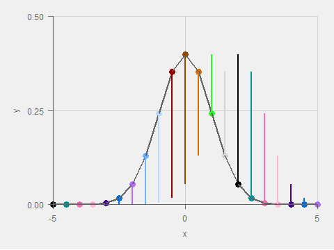

# (PART) Random {-}
```{r}
library(tidyverse)
library(pubtheme)
knitr::opts_chunk$set(
  echo    = TRUE,        ## show or suppress the code
  include = TRUE ,       ## show or suppress the output
  message = FALSE,       ## omit messages generated by code
  warning = FALSE,       ## omit warnings generated by code
  comment = NA,          ## removes the ## from in front of outputs
  error   = F,           ## stop on errors
  # cache   = T,         ## cache time consuming code
  
  fig.align  = "center", ## centers all figures
  fig.height = 5,        ## set the default height
  fig.weight = 5         ## set the default width
  )

```

# Introduction

This is a collection of random (in the non-statistical meaning of the word) stuff that I have found to be useful over the years. 

This is constantly under construction and may not (if by "may not" I mean "definitely does not") have complete explanations of the code, results, and purpose of each section. 


# Project development and planning

## Brainstorming, determining the end deliverables

Before starting to code, we want to think about the big picture goals of the project and a plan to achieve those goals. Once we have the end goal in mind, we can work backwards from that. 

Here's a nice clip of Steve Jobs from 1997 talking about how Apple wants to start with what the end deliverable is going to be to the customer, and how it will benefit the customer. A couple of quotes:

- "You've gotta start with the customer experience and work backwards to the technology. You can't start with the technology and figure out where you are going to try to sell it." 
- "As we have tried to come up with a strategy and a vision for Apple, it started with 'what incredible benefits can we give the customer, where can we take the customer', not starting with 'let's sit down with the engineers and what awesome technology we have, and how we are going to market that.'" 

(The clip is also a nice example of how to respond to criticism.)

We can start by asking ourselves these questions

- What would be the most useful deliverable for the end user? What is *their* end goal, and how can we help them? What is their background, and what skills, experience and understanding do they have?
- What important factors should be included in our analysis? What will the end user want to be included in any analysis? What will they ask about? What data do we have, and what information in the data do we want to be used? 
- How will the results of the analysis be delivered? How would we want to use the results if we were in the end users shoes? How could the results be used in meetings, in informal one-on-one conversations, by individuals in their own time, or in other situations?

Those are just some examples of questions to consider. We can think about anything else that We think could be important for a specific project. 

We are not necessarily bound to any of these goals or end deliverables, and they may need to be modified as we start working and realize what we can and can not do. But it is important to start with the end, and always keep the end on top of mind throughout the development process. 

## Create a basic framework

1. **Main steps.** Think about the 3-5 (or more) main steps that need to be done (for example data cleaning, modeling, etc., or something more specific to this project) and the details of what needs to be done in each of those steps.  
2. **Sub steps.** For each of those main steps, think about how to break the work into a few parts. If you are working in a group, do this so that the steps can be worked on in parallel by the members of your group. 
3. **Main script.** Create a `main.r` script that looks like this that will serve as a sort of outline for all of your scripts or functions

```
## main.r
## This script runs all code related to gymnastics case study. 
## It reads data and generates all outputs. 

source('R/get.data.r')
source('R/prep.data.r')
source('R/fit.model.r')
## etc

```

If you use functions instead of scripts, it might look like this

```
## main.r
## This script runs all code related to gymnastics case study. 
## It reads data and generates all outputs. 

## Load functions here
source('R/myfunctions.r')


## Get and prep data, fit models, etc
df = get.data()
dc = prep.data(df)
m  = fit.model(dc)
## etc

```


4. **Outline.** For each of your main steps from #1, create a new file containing either functions or scripts and write an outline in that file.  For example, a script `prep.data.r` might look like this

```
## prep.data.r
## This script prepares the data from the csv files for modeling

## First, deduplicate names, clean dates, etc

## Then, create some predictors

## etc (add more subheadings for other main tasks)

```

Think about the inputs, outputs, and how the data will need to be structured at each stage, and write notes to yourself in these files about that.  Note that you are creating `.R` files, not `.Rmd` files

Once again we are not bound to exactly the structure that we create in this part. This main file can be modified as we modify different steps of the project, or modify the end goal. But we can at least establish a structure that is easily modifiable  

5. **Visualize the pipeline (Optional)** If you write functions, you can try using the package `vizdataflow` https://github.com/bmacGTPM/vizdataflow to visualize your workflow. This is a package I started developing and it's only like Version 0.1 alpha, but you still might find it useful. This is purely optional. If you do use it, I'd be interested in your feedback. What do you wish the packages could do?

## Backwards planning

(Under construction). You can use "backwards planning" not just for outlining the steps of your project (as described above) but also for creating a timeline for the project (not to mention many other planning tasks in life). 

Start with the deadline and work backwards. Allow a chunk of time for all of the main steps you outlined for your project. 

Everyone has their own personal scaling factor they can use to make their time estimates more accurate.  You can start doing this for regular class assignments. Before you start a coding exercise, try estimating how long you think the coding exercise will take, and then keep track of the actual time. Ideally, exclude breaks and time spent/wasted checking TikTok.

It is easy to underestimate how much time you will spend on data preparation. Add extra time for data acquisition/cleaning/wrangling, especially if you are not already familiar with your data. It will probably take more time then you think. 


# Data acquistion

## Scrape HTML pages

```{r}
d1 = readLines(con = 'https://finance.yahoo.com/u/yahoo-finance/watchlists/most-active-small-cap-stocks')

## head(d1,2) ## huge mess of HTML code
```

Using `rvest` (https://rvest.tidyverse.org/):

```{r}
library(rvest)
d2 = read_html(
  'https://finance.yahoo.com/u/yahoo-finance/watchlists/most-active-small-cap-stocks'
  )
```

See https://rvest.tidyverse.org/articles/rvest.html for an intro to `rvest`. 

To save the object created using `read_html`, you can use `write_html`. 

```{r eval = F}
write_html(d2, file=myfilename)
```

You can then use `read_html` again to load `myfilename`. If you try to use `saveRDS` then `readRDS`, and then try to do something with that object like use `html_table`, you will get an error like `Error in xml_ns.xml_document(x) : external pointer is not valid`.  

The output `read_html` doesn't immediately look like the full HTML code like `scan` gives. To get the full HTML code, 

```{r}
d3 = d2 %>% as.character() %>% strsplit(split = '\n') %>% unlist()
```

This won't give exactly the same result as `scan`. It seems to create more lines of code - some longer lines of HTML code are split into multiple entries in the vector. 

```{r}
length(d1)
length(d3)
```

```{r}
d1[3]
d2
```


## Parsing HTML tables

`html_table` gives a list of data frames, one for every HTML table in the page.

```{r}
d2 %>% html_table() 
```

The `readHTMLTable` function is similar.

```{r}
library(XML)
d1 %>% readHTMLTable()
```


## Scraping pages that require log-in

Here is an example of scraping CBS sports fantasy baseball stats. To use this you would have to create a CBS sports log-in, and possibly a fantasy baseball league. But you should be able to easily modify it for another page that you have a log-in for. The main steps are before the for loop: `userid`, `password`, `uastring`, `login.url`,  and then using `session`, `html_form`, `html_form_set`, `session_submit`.

```{r eval = F}
library(rvest)
library(httr)
library(tidyverse)

## You will need to change the `userid` and `password` in line 22-23.  

## I recommend creating a Custom Report on the CBS player stats page 
## that has the same columns as those listed in lines 91-101 below. 
## You'll have to do it four times, (batting, pitching, one for each league)
## which is annoying, but worth it to scrape Salary and Contract.
## Call the custom report ForSpreadsheet.

## Otherwise, you'll have to change line 24 to report.name = 'standard'
## and edit lines 91-101 to have the columns in the standard report. 

## settings
years     = c(2013:2022, 'proj') ## 10 seasons, and projections
leagues   = c('al', 'nl')
positions = c('h' , 'p') 

userid      = 'myusername'
password    = 'mypassword'
report.name = 'ForSpreadsheet'

## log in to CBS sports
uastring <- 'Mozilla/5.0 (Windows NT 10.0; Win64; x64) AppleWebKit/537.36 (KHTML, like Gecko) Chrome/99.0.4844.74 Safari/537.36'

login.url = 'https://www.cbssports.com/login'

s<-session(login.url, 
           user_agent(uastring))
s

f<-html_form(s)[[1]]
f

ff<-html_form_set(f, 
                  userid   = userid, 
                  password = password)
ff

session_submit(s, 
               form   = ff, 
               submit = '_submit')


## now that your logged in, loop over year, league, and batter/pitcher

for(year in years){
  cat(year, '')
  
  for(lg in leagues){
    cat(lg, '')
    
    for(pos in positions){
      cat(pos, '')
      
      if(lg   == 'al'  ){site.name = 'thegbsl'}
      if(lg   == 'nl'  ){site.name = 'ohdean'}
      if(pos  == 'h'   ){pos.url   = 'C:1B:2B:3B:SS:MI:CI:OF:DH'}
      if(pos  == 'p'   ){pos.url   = 'P'}
      if(year == 'proj'){year.url  = 'as-restofseason'}
      if(year != 'proj'){year.url  = year}
      
      url = paste0('https://', 
                   site.name, '.baseball.cbssports.com/stats/stats-main/all:', 
                   pos.url, '/', 
                   year.url, ':p/', 
                   report.name, '?print_rows=9999')
      url ## check

      ## go to desired page
      page = session_jump_to(s, url)
      page
      
      ## extract the table
      d = page %>% 
        html_table(header = T)
      
      dd = d[[2]] %>% ## table is in the second item of the list
        as.data.frame()
      
      ## the first row should be the column names, so
      ## put the first row there,
      ## and remove the first row
      ## Also, remove the first column, which looks like garbage
      colnames(dd) = dd[1,] 
      head(dd)
      
      dd = dd[-1,] ## now remove 1st row
      head(dd)
      
      ## remove last row
      dd = dd[-nrow(dd), ]
      
      ## select columns and save
      if(pos == 'h'){
        dd = dd %>%
          select(Player, Avail, Eligible, Salary, Contract, 
               G, AB, H, R, HR, RBI, SB, BB, TB, HP, Rank) 
      }
      
      if(pos == 'p'){
        dd = dd %>%
          select(Player, Avail, Eligible, Salary, Contract, 
                 APP, W, S, H, HR, ER, BB, K, INN, Rank) 
      }
        
      head(dd)
      
      filename = paste0('data/', 
                        lg, '-stats-', 
                        year, '-', 
                        pos, '.csv')
      filename
      
      write.csv(dd, file = filename, row.names = F)
      
    }
  }
}
```

## Scraping data that appears in javascript tables (coming soon!)

## Scrape PDFs

You can scrape text from PDFs like this. Note that I added `eval = F` because of issues with GitHub Actions. 

```{r, eval = F}
library(pdftools)
d <- pdf_data("https://www.omegatiming.com/File/0001170100020304FFFFFFFFFFFFFF02.pdf")
is(d)
length(d)
head(d[[1]])
```

It gives a list of data frames, one data frame for each page, that contains each word on the page and its  (x,y) location. 

## RSelenium, Docker

I don't have much to write up yet, but here are some links taken from the RSelenlium CRAN page https://cran.r-project.org/web/packages/RSelenium/:

- Basics. https://cran.r-project.org/web/packages/RSelenium/vignettes/basics.html
- Docker. https://cran.r-project.org/web/packages/RSelenium/vignettes/docker.html

This from Stack Overflow might be useful, but it is a few years old so it might no longer be applicable.
https://stackoverflow.com/questions/43580133/how-to-use-rselenium-to-login-to-a-website-on-windows-machine

## Excel

You can use the `xlsx` package, or the `tidyverse` package `readxl`. 
https://readxl.tidyverse.org/


## Census data with `tidycensus`

See [R/census](https://github.com/bmacGTPM/notes/tree/main/R/census)

This is example code that can be used to pull data from the US census into R as a data frame

At the top of `get.census.data.r`, there are URLs you can use to determine what variables you want to pull. For the census data used in these notes, I used the ACS link, and when I got to that page, I chose HTML format for 2019.

If you keep the line `us <- unique(fips_codes$state)[1]` the same, it will only pull census info for the first state, Alabama.  It's quick and a good way to check and make sure your code is running properly. To do all states and DC, change [1] to [1:51]. There are some US territories in this data, so you likely want to stop at 51.

```{r eval = F}
## get.census.data.r
## Script retrieves, cleans and saves Census data to rds file 
## (GEOID, Median Income, Total Population, Total Age, etc)

## See these for the variable codes:
# Census API: https://www.census.gov/data/developers/data-sets.html
# ACS:        https://www.census.gov/data/developers/data-sets/acs-1year.html
# Decennial:  https://www.census.gov/data/developers/data-sets/decennial-census.html

library(tidycensus)
library(tidyverse)
year=2019


## You need a census API key. 
## See https://api.census.gov/data/key_signup.html
## Once you get it, you can store it using 
## census_api_key('yourAPIkeyHere', install=TRUE)
## That only needs to be done once (hopefully) 
## and it will be stored in your .Renviron file. 
## Then you can use this  
readRenviron("~/.Renviron") 

## all
us <- unique(fips_codes$state)[1] ## change to 1:51 for all states and DC

## for ACS
vars <- c(# Total, Male, Female
                  "B01001_001", "B01001_002", "B01001_026", 
                  
                  # Median age, Male age, Female age
                  "B01002_001", "B01002_002", "B01002_003", 
                  
                  # Race: White, Black, Native, Asian, Pacific, Other, 2+
                  "B02001_002", "B02001_003", "B02001_004", 
                  "B02001_005", "B02001_006", "B02001_007", "B02001_008", 
              
                  # white non-hispanic, hispanic, white hisp, black hisp
                  "B03002_003", "B03002_012", "B03002_013", 'B03002_014',
               
                  # Household income ranges: 
                  # <10k, 10000-14999, ... , 150000-199999, >200k 
                  "B19001_001", "B19001_002", "B19001_003", "B19001_004",
                  "B19001_005", "B19001_006", "B19001_007", "B19001_008",
                  "B19001_009", "B19001_010", "B19001_011", "B19001_012",
                  "B19001_013", "B19001_014", "B19001_015", "B19001_016",
                  "B19001_017",
                  
                  "B19013_001", # Median Household Income
                  "B25077_001", # Median Housing Value
                  'B05009_001'  # Children
                  ) 

# fails with geometry = TRUE, so removing.  
# We get tract info from elsewhere anyway.
d = get_acs(geography = "tract",
            variables = vars, 
            state = us, 
            year = year) 

# census_data <- get_decennial(geography = "tract", 
#                              variables = vars, 
#                              state = 'CT', 
#                              year=2020) 

dd <- d %>%
  mutate(tract      = gsub(',.+|Census Tract ', '', NAME),
         county     = gsub(', [A-z]+$|'       , '', NAME), 
         county     = gsub('^.+, '            , '', county),
         state.full = gsub('.+, '             , '', NAME)) %>%
  select(GEOID, tract, county, state.full, variable, estimate) %>%
  pivot_wider(names_from  = variable, 
              values_from = estimate) %>%
  rename(                'pop' = 'B01001_001', ## total population
                        'male' = 'B01001_002', ## sex
                      'female' = 'B01001_026',
                         'age' = 'B01002_001', ## age
                    'male.age' = 'B01002_002',
                  'female.age' = 'B01002_003',
                  
                       'white' = 'B02001_002', ## race
                       'black' = 'B02001_003',
              'indian.alaskan' = 'B02001_004',
                       'asian' = 'B02001_005',
                     'pacific' = 'B02001_006',
                       'other' = 'B02001_007',
                 'two.or.more' = 'B02001_008',
              'white.not.hisp' = 'B03002_003',
                        'hisp' = 'B03002_012',
                  'white.hisp' = 'B03002_013',
                  'black.hisp' = 'B03002_014',
                  'households' = 'B19001_001',
         
                   'i10orless' = 'B19001_002', ## income
                     'i10to14' = 'B19001_003',
                     'i15to19' = 'B19001_004',
                     'i20to24' = 'B19001_005',
                     'i25to29' = 'B19001_006',
                     'i30to34' = 'B19001_007',
                     'i35to39' = 'B19001_008',
                     'i40to44' = 'B19001_009',
                     'i45to49' = 'B19001_010',
                     'i50to59' = 'B19001_011',
                     'i60to74' = 'B19001_012',
                     'i75to99' = 'B19001_013',
                    'i100to124'= 'B19001_014',
                    'i125to149'= 'B19001_015',
                    'i150to199'= 'B19001_016',
                   'i200ormore'= 'B19001_017',
                   'hh.income' = 'B19013_001',
                 'house.value' = 'B25077_001',
               'TotalChildren' = 'B05009_001' # doesn't exist for 2009
         ) %>%
  as.data.frame()
head(dd)

## save census data
# filename = paste0('rawdata/census', year, '.rds')
# saveRDS(dd, file = filename)

```

## JSON

## Connecting to SQL databases

## Shape files .shp


# Data cleaning


## RecordLinkage

When joining data sets, you ideally have a unique id, or key, to join on. Sometimes that key does not exist, and you have to join on names or other information. Unfortunately, names are often spelled differently in the different data sets. Fortunately, the package `RecordLinkage` can help you identify near matches and deduplicate names.

### Example data
```{r}
library(ff) ## keep this
library(RecordLinkage)
d = data.frame(name = c('Alexander Ovechkin', 
                        'Alex Ovechkin', 
                        'Alikandre Ohvechken', 
                        'Sydney Crosby', 
                        'Sidnee Krawsby'), 
                dob = c('1985-09-17', 
                        '1985-09-17', 
                        '1985-09-17', 
                        '1987-08-07',
                        '1987-08-07'))
d
```

### Compare/Dedup

Phonetic match

```{r}
dd1 = compare.dedup(d, 
                    phonetic = 'name', 
                    strcmp   = FALSE)

dd1$pairs
```


String match

```{r}
dd2 = compare.dedup(d, 
                    phonetic = FALSE , 
                    strcmp   = 'name', 
                    blockfld = 'dob')
dd2$pairs
```

Because `blockfld = 'dob'` is used, if `dob` doesn't match, the pair doesn't even get a string match rating and the pair is removed from the list. So there are only 4 rows here. 

Merge both results:

```{r}
dd  = merge(dd1$pairs, 
            dd2$pairs, 
            by   = c('id1', 'id2'), 
            all  = T, 
            sort = F, 
            suffixes = c('.pho', '.str')) ## phonetic and string
dd
```

### Attach names to IDs

Since `id1` and `id2` aren't super helpful, let's add names to this data frame. And get rid of NAs and a couple columns we don't need.

```{r}
dd$name1 = d$name[dd$id1]
dd$name2 = d$name[dd$id2]

dd = dd %>% 
  filter(!is.na(name.str), 
         !is.na(name.pho)) %>%
  select(-is_match.pho, 
         -is_match.str) %>%
  arrange(desc(name.str)) 

head(dd,20)

```


## Unnesting lists


## Data imputation

If you have tons of missing data, you may find this useful.  
https://www.analyticsvidhya.com/blog/2016/03/tutorial-powerful-packages-imputing-missing-values/

Scroll down to the `Hmisc` section.  The function `aregImpute` can be used for multiple imputation. 

### Example with simulations

Are uncertainties smaller than they should be? Without knowing a theoretical result, can we simulate to answer this question? 


## Random useful functions

### Formatting for display
```{r}
str_to_title('hello there')
```

### Distance from point to line
https://www.rdocumentation.org/packages/geosphere/versions/1.5-18/topics/dist2Line

### Holidays

Use `timeDate::holiday` to get the date of a holiday in a year. 

```{r}
library(timeDate)
holiday(year = 2023, Holiday = "USThanksgivingDay") %>%
  as.Date()
```

# Data visualization

## Esquisse

With `esquisse` you play around with `ggplot` visualizations using a GUI similar to Tableau and other visualization software packages. If you like a plot you can copy the code (lower right), paste it into a R script or Rmd file and edit it further.  

```{r eval = F}
library(esquisse)
esquisser(mtcars)
```

## Animating normal PDFs

Sometimes when animating a normal PDF the curve can appear to bounce up and down, and can look incorrect. This animation shows how certain points move from frame to frame and helps explain why the "bouncing" happens. 

Note that the points have fixed $x$ coordinates, and the $y$ coordinates change in each frame of the animation. The vertical lines show the paths of those points. The normal curve connecting the points appears to bounce up and down because of where the points are located while transitioning from frame to frame.  

```{r fig.height = 4, fig.width = 8}
library(tidyverse)
library(gganimate)
library(pubtheme)

x = rep(seq(-5, 5, by=.5))

df = data.frame(frame = rep(1:3, 
                            each = length(x)), 
                x = c(x,x,x), 
                y = c(dnorm(x, 0, 1), 
                      dnorm(x, 1, 1), 
                      dnorm(x, 2, 1)) %>% 
                  round(3), 
                id = x)
head(df)
tail(df)

df.prior = df %>% 
  filter(frame == 1) %>% 
  select(-frame)

g = ggplot(df, 
           aes(x = x, y = y))+
  geom_point(data  = df.prior, 
             color = 'gray')+
  geom_line (data  = df.prior, 
             color = 'gray')+
  geom_point(aes(color = as.factor(x)), 
             show.legend = F, 
             size = 4)+ 
  geom_line(show.legend = F)+
  geom_line(data = df %>% select(-frame), 
            aes(color = as.factor(x)), 
            show.legend = F)+
  scale_color_manual(values = rep(cb.pal, 
                                  length.out = length(x)))
  
g = g %>% 
  pub(xlim = c(-5, 5), 
      ylim = c(0, .5))

## check by plotting frames in different windows
g + 
  facet_wrap(~frame)
```

```{r}
## animate
# gg = g +
#   transition_states(frame,
#                     transition_length = 1,
#                     state_length      = 0,
#                     wrap = F) +
#   ease_aes('linear')
# 
# a = animate(gg, 
#             height = 1440/3*3/4, 
#             width  = 1440/3,
#             fps = 10,
#             duration = 4,
#             end_pause = 10)
# a
# anim_save(a, filename = 'img/normal-dist.gif')
```

     

## HTML formatting in ggplot

Use HTML to format text and include images in ggplot axes labels (`element_markdown`) and point labels (`geom_richtext`).

- https://wilkelab.org/ggtext/
- With country flags, downloaded from wikipedia https://www.r-bloggers.com/2019/08/ggtext-for-images-as-x-axis-labels/#google_vignette

## Leaflet

- Provider tiles: https://leaflet-extras.github.io/leaflet-providers/preview/

## geom_polygon

See also the hexbin templates in `pubtheme`. 

```{r}
## Data frame with coordinates of the corners of polygons
## along with which polygon each x,y cooresponds to, 
## and a probability to be used to fill the polygon
df = data.frame(    x=c(1,2,2,1, 3,4,4),
                    y=c(1,1,2,2, 1,1,2), 
                group=c(1,1,1,1, 2,2,2), 
                    p=c(.1,.1,.1,.1, .2, .2, .2))
ggplot(df, 
       aes(x, y, 
           group=group, ## says which shape each x,y belong to 
           fill=p))+    ## says to color by p
  geom_polygon()

```


# Analysis

## Variable importance

- RF variable importance
- Shapely values

## Compariable observations

## Other types of regression models

- **Multinomial regression.** Like logistic regression, but for categorical outcomes with 2 or more categories. See ROS, 15.5. R package: `polr`. For multi-class log loss you can use the 
`MultiLogLoss` from the `MLmetrics` package. See [here](https://rdrr.io/cran/MLmetrics/man/MultiLogLoss.html)
- **Zero-inflated Poisson or Negative Binomial regression.** Can be useful for count outcomes where there are  more zeros than predicted by a (standard) Poisson or negative binomial regression model. This could potentially be used for the EV charging station data (we removed all census tracts with zero charging stations). See ROS 15.8 and BMLR 4.10. R Package: `zeroinfl`. 
- **Harmonic regression.** Fit the best sine/cosine curve to data. https://rdrr.io/cran/HarmonicRegression/man/harmonic.regression.html
- **Beta regression.** When outcome has values in the open interval (0,1) (not just 0 and 1, the *open interval* (0,1) and can be assumed to be y ~ Beta(\alpha, \beta). Like when the outcome is a proportion. Generalizable to an interval (a,b) using transformations. https://cran.r-project.org/web/packages/betareg/vignettes/betareg.pdf. 
- **Dirichlet regression.** Kind of like multinomial logit regression is a generalization of logistic regression, this is a generalization of Beta regression. Model the proportions of two or more outcomes, proportions sum to 1. Package: https://cran.r-project.org/web/packages/DirichletReg/DirichletReg.pdf
- **Spline regression.** Piecewise polynomial
- **Discussion of Ridge, Lasso, and Bayes. **
https://ekamperi.github.io/mathematics/2020/08/02/bayesian-connection-to-lasso-and-ridge-regression.html
- **Bayesian regression**. https://stat.columbia.edu/~gelman/book/
- **Splines**. Piecewise polynomials with continuity constraints. See ISLR https://www.statlearning.com/ Section 7.4 Regression Splines, Section 7.5 Smoothing Splines, and 7.8.2 (lab exercises). 
- **Ordinal regression**. Function `polr` in `MASS`. 
- **Regularized ordinal regression**. https://stackoverflow.com/questions/75790997/why-do-the-coefficents-from-orginal-regularized-regression-ordinalnet-have-the
- **Mixed effects ordinal regression**. https://stats.stackexchange.com/questions/238581/how-to-use-ordinal-logistic-regression-with-random-effects
- **Random Forest.** Packages `randomForest`, and maybe `Rborist`, `ranger`, `h20ai`. Some of these behaved weirdly, if I recall correctly.


### Multivariate regression

- Vignette https://cran.r-project.org/web/packages/rrr/vignettes/rrr.html
- Multivariate linear regression https://library.virginia.edu/data/articles/getting-started-with-multivariate-multiple-regression
- Multivariate Poisson regression slides: http://www2.stat-athens.aueb.gr/%7Ekarlis/multivariate%20Poisson%20models.pdf
- Bivariate Poisson https://rss.onlinelibrary.wiley.com/doi/full/10.1111/1467-9884.00366
- Paper: A multivariate Poisson regression model for count data.  https://www.ncbi.nlm.nih.gov/pmc/articles/PMC9041711/

## Time series

- Bootstrapping: https://towardsdatascience.com/time-series-bootstrap-in-the-age-of-deep-learning-b98aa2aa32c4

## Calibration

- Logistic regression is well-calibrated: https://stats.stackexchange.com/questions/208867/why-does-logistic-regression-produce-well-calibrated-models


# Bayesian estimates

## Beta-binomial

Prior

- $p \sim Beta(\alpha, \beta)$
- $E[p] = \frac{\alpha}{\alpha + \beta}$
- $Var[p] = \frac{\alpha\beta}{(\alpha+\beta)^2 (\alpha + \beta + 1)}$

Data: y, n

Posterior
- $E[p|y]   = \frac{\alpha + y}{\alpha + \beta + n}$
- $Var[p|y] = \frac{(\alpha+y)(\beta+n-y}{(\alpha+\beta+n)^2 (\alpha + \beta + n + 1)}$

Posterior alpha and beta for plotting the posterior distribution
from https://en.wikipedia.org/wiki/Beta_distribution#Mean_and_variance

- $\nu = \frac{\mu(1-\mu)}{\sigma^2} - 1$
- $\alpha = \mu\nu = \mu\Big(\frac{\mu(1-\mu)}{\sigma^2} - 1\Big)$
- $\beta = (1-\mu)\nu = (1-\mu)\Big(\frac{\mu(1-\mu)}{\sigma^2} - 1\Big)$

Example code

```{r}
alpha = 2   
beta  = 2   

mu = alpha*beta
sigma2 = alpha*beta/((alpha+beta)^2*(alpha + beta + 1))

## suppose y successes in n trials games
y = 10
n = 10

## Posterior mean and variance
post.mu = 
  (alpha + y)/
  (alpha + beta + n)

post.sigma2 = 
  (alpha + y)*(beta + n - y)/
  ((alpha + beta + n)^2*(alpha + beta + n + 1))

## Determine new alpha and beta based on new mu and sigma for plotting.
post.alpha =  alpha + y  
post.beta  = beta + n - y 

## Plot posterior first b/c of the y limits
x = seq(0, 1, by=0.01)
df = data.frame(x = x, 
                y1 = dbeta(x = x,
                           shape1 = alpha, 
                           shape2 = beta),
                y2 = dbeta(x = seq(0, 1, by=0.01), 
                          shape1 = post.alpha, 
                          shape2 = post.beta))

ggplot(df, aes(x = x)) + 
  geom_line(aes(y = y1)) +                        ## prior
  geom_line(aes(y = y2), color = 'blue') +        ## posterior
  geom_vline(xintercept = post.mu, color = 'red') ## posterior mean

post.mu

```

You can choose alpha and beta using the mean and variance of your data (https://en.wikipedia.org/wiki/Beta_distribution#Mean_and_variance). 

```{r}
## Compute mean and variance from data 
mu = .5
sigma2 = 0.05

## Find the alpha and beta for the corresponding Beta distribution
nu    = mu*(1-mu)/sigma2 - 1
alpha =    mu * nu
beta  = (1-mu)* nu
alpha
beta
```


## Normal


## Data augmentation
See maybe here https://www.math.unm.edu/~fletcher/PDF/PUB-PDF/SANDER.PDF and maybe, but probably not, here https://staffblogs.le.ac.uk/bayeswithstata/2015/04/10/poisson-regression-with-two-random-effects-mcmc-by-data-augmentation-part-ii/

Note to self: See ChatGPT answer :)

# Simulating data

Simulated data using models with varying intercepts, varying intercepts and slopes, and neither. 

## Continuous and binary predictors

First, create simulated continuous predictor $x_1$ and binary predictor $x_2$.

```{r}
set.seed(1)
n = 10000

## Create x data
x1 =  runif(n, min = 0, max = 1)
x2 = rdunif(n, b   = 0, a   = 1)

## Put them in a data frame
dg = data.frame(x1, x2)
```

## Linear regression with a continuous predictor

Simulate $y$ data for the simple linear regression model with one continuous predict $x_1$,
$$y \sim N(\mu, \sigma^2), \\ \quad \mu = \beta_0 + \beta_1x + \epsilon, \quad \epsilon \sim N(0, .1^2),$$

and then plot.

```{r fig.width = 5, fig.height = 5}
dg$y = 0 + 2*x1 + rnorm(n, 0, .1)

g = ggplot(dg, 
           aes(x1, y))+
  geom_point(alpha = 0.1)

g %>% 
  pub(xlim = c(0,1))

```

## Poisson regression with a continuous predictor

Simulate $y$ data for Poisson regression with one continuous predictor $x_1$, 
$$y \sim Poisson(\lambda), \\ \lambda = e^{\beta_0 + \beta_1x},$$

and then plot. 

```{r fig.width = 5, fig.height = 5}
dg$y = rpois(n = n, lambda = exp(0+ 2*x1))

g = ggplot(dg, 
           aes(x1, y)) + 
  geom_jitter(width  = 0, 
              height = 0.2, 
              alpha  = 0.3)

g %>% 
  pub(xlim = c(0,1))
```

## Linear regression with an extra binary predictor

Simulate $y$ data for a linear regression model with one continuous predictor $x_1$ and one binary predicor $x_2$. This has a varying intercept. 

```{r fig.width = 5, fig.height = 5}
dg$y = 0 + 2*x1 + 3*x2 + rnorm(n, 0, .1)

g = ggplot(dg, 
           aes(x1, 
               y, 
               group = x2))+
  geom_point(alpha = 0.1)

g %>% 
  pub(xlim = c(0,1))

```

## Poisson regression with an extra binary predictor

Simulate $y$ data for a Poisson regression with one continuous predictor $x_1$ and one a binary predicor $x_2$. This is Poisson regression with a varying intercept. 

```{r fig.width = 5, fig.height = 5}
dg$y = rpois(n = n, lambda = exp(0 + 0.5*x1 + 1*x2))

g = ggplot(dg, 
           aes(x = x1, 
               y = y, 
               color = as.factor(x2), 
               group = x2)) +
  geom_jitter(show.legend = F, 
              alpha  = 0.1, 
              width  = 0, 
              height = 0.3) +
  geom_smooth(linewidth   = 3)

g %>% 
  pub(xlim = c(0, 1 ), 
      ylim = c(0, 14))

```

## Linear regression with interaction

Simulate $y$ data for a linear regression with one continuous predictor $x_1$ and one a binary predictor $x_2$, and an interaction term. This is linear regression with varying intercept and varying slope. 

```{r fig.width = 5, fig.height = 5}
dg$y = 0 + 2*x1 + 3*x2 + 2*x1*x2 + rnorm(n, 0, .1)

g = ggplot(dg, 
           aes(x1, 
               y, 
               group = x2))+
  geom_point(alpha = 0.1)

g %>% 
  pub(xlim = c(0,1))
```

## Poisson regression with interaction

Simulate $y$ data for a Poisson regression with one continuous predictor $x_1$ and one a binary predicor $x_2$, and an interaction term. This is Poisson regression with varying intercept and varying slope. 
```{r fig.width = 5, fig.height = 5}
dg$y = rpois(n = n, 
             lambda = exp(0 + 0.5*x1 + 1*x2 + 1*x1*x2))

g = ggplot(dg, 
           aes(x = x1, 
               y = y, 
               color = as.factor(x2))) +
  geom_jitter(show.legend = F, 
              alpha  = 0.1, 
              width  = 0,
              height = 0.3) +
  geom_smooth(show.legend = F, 
              linewidth   = 3)

g %>% 
  pub(xlim = c(0,1))

```

# Shiny

## Getting started

- Check out [this](https://shiny.posit.co/r/getstarted/shiny-basics/lesson1/index.html).  You can follow the Getting Started steps to start.  If they show simple examples of apps, make sure you run them on your machine. 
- There is a simple app at `data/Week3Day2app.zip` in the GitHub repo. Check that out and play around with it. You'll have to unzip that and make sure the data is in the same folder as the app.  (Note that all files referenced by an app must be contained in the same folder, or in a subfolder of that folder. It is like RMD files in that way.) Then open `app.R` in RStudio and click "Run App" in the upper right of the window (where it says "Source" when you have a `.R` file or "Run" when you have an `.Rmd` file, but with an `app.R` file it should say Run App). That should open the app and you can play around with it. You can see what code makes different pieces of the app.  
- Familiarize yourself with the [cheatsheet](https://shiny.posit.co/r/articles/start/cheatsheet/). (you can skip the "reactive" section for now)
- Take a look at the [Gallery](https://shiny.posit.co/r/gallery/) You don't have to know how to do everything there, but you can familiarize yourself with what is possible.
- Take a look at the [Articles](https://shiny.posit.co/r/articles/) page. Same as above: you don't have to read all of them, but familiarize yourself with what is there.


## Dynamic UI

Here are options for creating UIs that depend on other UIs, using `conditionalPanel` and `renderUI` https://shiny.posit.co/r/articles/build/dynamic-ui/. 

Another resource: https://mastering-shiny.org/action-dynamic.html


Here is an example that makes a second UI appear if certain selections are made in the first UI. This is also app.R on GitHub.

```{r eval = F}
library(shiny)
ui <- fluidPage(
  selectInput("dataset", "Dataset", c("diamonds", "rock", "pressure", "cars")),
  conditionalPanel( condition = "output.nrows",
                    checkboxInput("headonly", "Only use first 1000 rows"))
)
server <- function(input, output, session) {
  datasetInput <- reactive({
    switch(input$dataset,
           "rock" = rock,
           "pressure" = pressure,
           "cars" = cars)
  })
  
  output$nrows <- reactive({
    nrow(datasetInput())
  })
  
  outputOptions(output, "nrows", suspendWhenHidden = FALSE)  
}

shinyApp(ui, server)
```

### Example App: CLT

See CLTapp.r on GitHub for an example app where UI labels change based on the selection in another dropdown. 

## Click leaflet map

Some info about using leaflet with shiny. https://rstudio.github.io/leaflet/shiny.html

Example of clicking on a leaflet map and getting coordinates

```{r eval = F}
library(shiny)
library(leaflet)
library(tidyverse)

# Define UI
ui <- fluidPage(
  titlePanel("Example"),
  mainPanel(leafletOutput("map"))
)

# Define server logic, and account for User interaction
server <- function(input, output, session) {
  output$map <- renderLeaflet({ 
    mymap <- leaflet() %>% 
      addTiles() %>% 
      setView(lng = -73.95, 
              lat = 40.73, 
              zoom = 12)
    mymap
  })
  
  # when map is clicked, get the coordinates and show marker on the map 
  observeEvent(input$map_click, {
    click <- input$map_click
    
    ## print coords to the console
    print(click)
    
    ## display the click on the map
    proxy <- leafletProxy("map")
    proxy %>% 
      clearGroup("new_point") %>% ## remove the previous point
      addCircles(click$lng, 
                 click$lat,
                 radius = 100, 
                 color  = "red", 
                 group  = "new_point")
  })
}

shinyApp(ui = ui, server = server)
```

## Draw a shape on a leaflet map

Copied from the answer here: https://stackoverflow.com/questions/48858581/get-coordinates-from-a-drawing-object-from-an-r-leaflet-map

```{r eval = F}
library(leaflet.extras)

# Define UI 
ui <- fluidPage(
  leafletOutput("mymap",height=800)
)

# Define server logic 
server <- function(input, output) {
  
  output$mymap <- renderLeaflet(
    leaflet() %>%
      addProviderTiles("Esri.OceanBasemap",group = "Ocean Basemap") %>%
      setView(lng = -166, lat = 58.0, zoom = 5) %>%
      addDrawToolbar(
        targetGroup='draw',
        editOptions = editToolbarOptions(selectedPathOptions = selectedPathOptions()))  %>%
      addLayersControl(overlayGroups = c('draw'), options =
                         layersControlOptions(collapsed=FALSE))
  )
  
  observeEvent(input$mymap_draw_new_feature,{
    feature <- input$mymap_draw_new_feature
    
    print(feature)
    
  })
  
}

# Run the application
shinyApp(ui = ui, server = server)

```


## Save data generated from user inputs

Modified from here https://stackoverflow.com/questions/63329561/r-shiny-load-data-in-to-form-fields-from-previously-persistent-stored-data. See also the links given in the answer to that question. There is a New button, which resets the user inputs. There is a Delete button, which I thought was supposed to delete entries but it doesn't seem to work. 

```{r eval = F}
library(shiny)

# Define the fields we want to save from the form
fields <- c("name", "used_shiny", "r_num_years")

outputDir <- "responses"

saveData <- function(data) {

  # Create a unique file name
  fileName <- sprintf("%s_%s.csv", as.integer(Sys.time()), digest::digest(data))
  
  # Write the file to the local system
  write.csv(
      x = data,
      file = file.path(outputDir, fileName), 
      row.names = FALSE, quote = TRUE
  )
}

loadData <- function() {
    
    # Read all the files into a list
    files <- list.files(outputDir, full.names = TRUE)
    data <- lapply(files, read.csv, stringsAsFactors = FALSE) 
    
    # Concatenate all data together into one data.frame
    data <- do.call(rbind, data)
    data
}

# Shiny app with 3 fields that the user can submit data for
shinyApp(
    ui = fluidPage(
        DT::dataTableOutput("responses", width = 300), tags$hr(),
        textInput("name", "Name", ""),
        checkboxInput("used_shiny", "I've built a Shiny app in R before", FALSE),
        sliderInput("r_num_years", "Number of years using R",
                    0, 25, 2, ticks = FALSE),
        actionButton("submit", "Submit")
    ),
    
    server = function(input, output, session) {

        # When the Submit button is clicked, save the form data
        observeEvent(input$submit, {
            df = data.frame(name=input$name, 
                            used_shiny = input$used_shiny, 
                            r_num_years = input$r_num_years)
            df
            saveData(df)
        })
        
        # Show the previous responses
        # (update with current response when Submit is clicked)
        output$responses <- DT::renderDataTable({
            input$submit
            loadData()
        })     
    }
)
```


# Understanding how functions work

## Help 
We can get help on a function by typing `?sd` in the console or clicking the Help tab in the lower right of RStudio. 

## Code
We can actually see the contents of a function by typing `sd` (with no `?` and no parentheses). Sometimes we will see the function explicitly written out. Here is the code for `sd`.

```{r}
sd
```
The code for `sd` finds the square root of the variance of `x`. 

### Generic functions

If we try to look at the code for `print`, we'll see this.

```{r}
print
```
All we see here is `UseMethod("print")` because `print` is a generic function that will use different code depending on whether we give it a `data.frame`, `list` or some other object.  For example, if we give `print` a `list`, it will show each object in the list, each labeled with `$nameoftheobject` and separated by a blank line.

```{r}
mylist = list(x1 = 1:10, 
              x2 = 11:20, 
              x3 = 21:30, 
              x4 = 31:40, 
              x5 = 41:50, 
              x6 = 51:60, 
              x7 = 61:70)
is(mylist)
print(mylist)
```

If this `list` were a `data.frame` object, it would show a table of data. 

```{r}
my.df = as.data.frame(mylist)
is(my.df)
print(my.df)
```

If we have an `lm` object that is the result of fitting a linear regression to data using the function `lm`, `print` shows some basic information about the model. 

```{r}
lm1 = lm(mpg  ~ wt, 
         data = mtcars)
is(lm1)
print(lm1)
```
If we have a `summary.lm` object, `print` will give an output with coefficients, standard errors, *t*-statistics, *p*-values, the significance stars, $R^2$, Adjusted $R^2$, and so on

```{r}
lm1.summary = summary(lm1)
is(lm1.summary)
print(lm1.summary)
```

### `methods`

We can use `methods` to see what objects the function `print` has methods for. 

```{r}
methods('print') %>% head(20)
```
We are using `head` (also generic!) to only show the first 20 methods. There are actually several hundred!

```{r}
length(methods('print'))
```
Here are the methods that contain the character string `lm` as part of the name. 

```{r}
grep('lm', 
     methods('print'), 
     value = TRUE)
```
### `getAnywhere`
If we want to see the code for one of these methods, we can use `getAnywhere`. Let's see the code for `print.lm` and `print.summary.lm`. Since the output of `print(summary.lm)` above is much more detailed than `print(lm1)`, it is not surprising that the code for `print.summary.lm` is much more involved than the code for `print.lm`. 

```{r}
getAnywhere('print.lm')
```

```{r}
getAnywhere('print.summary.lm')
```

### Other resources

- This Stack Overflow answer is pretty useful and has more details. 
https://stackoverflow.com/questions/19226816/how-can-i-view-the-source-code-for-a-function

- More in *R for Data science*: https://r4ds.had.co.nz/vectors.html?q=methods#attributes

- More in *Advanced R*: http://adv-r.had.co.nz/OO-essentials.html#s3

## Functions with unquoted arguments

```{r}
library(tidyverse)
df <- tibble(
  a = sample(5), 
  b = sample(5)
)

lag1_mutate <- function(dt, varname, time) { 
  varname_t0 <- paste0(substitute(varname)); 
  varname_t1 <- paste0(substitute(varname), time); 
  dplyr::mutate(dt, !!varname_t1 := lag(!!rlang::sym(varname_t0))) 
}

lag1_mutate(df, a, 2) 
lag1_mutate(df, b, 3)
```


Adapted from here: https://stackoverflow.com/questions/46131829/unquote-the-variable-name-on-the-right-side-of-mutate-function-in-dplyr


# Debugging

## `browser()`

Inserting `browser` in our code somewhere will make `R` pause and allow us to explore the environment at that point.

## `debug`, `debugonce`

Running `debugonce('fun')` will send us into debug mode next time we use the function `fun`. 

# Testing

See `testthat` package. That's all I got for now!


# For loops

## Showing progress

You can add some code to a for loop that prints `j`, the iterator in a for loop. 

```{r}
for (j in 1:100){
  cat(j, '')
  Sys.sleep(1/100)
}
```

If you don't want to show every new `j`, you can add an if statement like this that prints every 10 `j`s for example. 


```{r}
for (j in 1:100){
  if(j %% 10 == 0){cat(j, '')}
  Sys.sleep(1/100)
}
```

Another option is to use the package `progress` to add a progress bar. 

```{r}
library(progress)
pb <- progress_bar$new(total = 100, )
for (j in 1:100){
  pb$tick()
  Sys.sleep(1/100)
}
```

```{r eval = F}

cli::cli_progress_bar('Title', 
                      total = 100, 
                      clear = FALSE, )
for (j in 1:100){
  cli::cli_progress_update()
  Sys.sleep(1/100)
}
cli::cli_progress_done()
```

## Parallel processing with `foreach`

If you have a for loop that is embarrassingly parallel, where each iteration is completely independent of the others, you can potentially use foreach to run mutiple iterations simultaneously on multiple cores on your computer. Here is an embarrassingly simple example.

This takes about 100 seconds.

```{r eval = F}
print(Sys.time())
for (j in 1:100){
  cat(j, '')
  Sys.sleep(1)
}
print(Sys.time())
```

This takes 19 seconds with 6 cores (plus some time spent on the initial setup). Note the `j =` instead  of `j in`. 

```{r eval = F}
library(doSNOW)
library(foreach)
library(parallel)


## Setup
n.cores = detectCores()-2 ## leave 2 cores unused so I can keep using computer

print(Sys.time())
cl = makeCluster(n.cores)
registerDoSNOW(cl)
print(Sys.time())
foreach(j = 1:100, .verbose=F) %dopar% {
  library(dplyr) ## you might need to load libraries that you use in the loop
  cat(j,'')
  Sys.sleep(1)
}
stopCluster(cl)
print(Sys.time())
```

Depending where are using `foreach`, you may want to save `.rds` files each run through the loop, or you may want to combine the result of each iteration of the loop  at the end.  This link shows the argument `.combine` can be used to do the latter. https://cran.r-project.org/web/packages/foreach/vignettes/foreach.html

Here is an example of using `rbind` to combine data frames from each iteration: https://stackoverflow.com/questions/14815810/append-rows-to-dataframe-using-foreach-package. Here is the minimal reproducible example from that page.

```{r eval = F}
resultdf = foreach(i = 1:10, .combine = rbind) %dopar% { 
  data.frame(x = runif(4), 
             i = i)
  }
```

The final objects from each `foreach` iteration get `rbind`ed together. In this case, the final object in each iteration is a `data.frame` with 4 rows and 2 columns. 

If you have a process that takes a long time, you'll definitely want to save your results somewhere, even if you are using this `rbind` functionality. If, for example, you are using `foreach` inside another `for` loop, then you can save the result of `foreach` like this.

```{r eval = F}

## Non-parallel for loop
for (j in 1:10){
  
  ## Parallel for loop
  resultdf = foreach(i = 1:10, .combine = rbind) %dopar% { 
    
    ## Do some stuff that creates a data frame 
    data.frame(x = runif(4), 
               i = i)
  }
  
  ## create file name for this iteration, and save
  myfilename = paste('filename', j, '.rds') 
  saveRDS(df, file=myfilename)      
}
```

Or, if the `foreach` iteration takes a long time, you can save the result instead each iteration. 

```{r eval = F}

## Non-parallel for loop
for (j in 1:10){
  
  ## Parallel for loop
  foreach(i = 1:10, .combine = rbind) %dopar% { 
    
    ## Do some stuff that creates a data frame or another object
    df = data.frame(x = runif(4), 
                    i = i)
    
    ## create file name for this iteration, and save
    myfilename = paste('filename-', j, '-', i, '.rds') 
    saveRDS(df, file=myfilename)      
  }

}
```

Your approach will depend on how long each iteration takes to run, how big the file sizes are etc.  However you choose to do it, you will have a collection of `.rds` files that can be read back into R and joined using `rbind` or some other method. 

# Efficient Programming

## Efficient R Programming online book

Here is a great resource https://csgillespie.github.io/efficientR/

## Alternatives to `rbind` for big data frames

When working with very large data frames, and iteratively adding rows using `rbind`, say, within a for loop, to grow the data frame, the process starts out fast but tends to become slow. This is because `rbind` creates a new data frame each time it is used, and as the data frame gets bigger and bigger, it becomes more difficult to find contiguous blocks of memory to store the data frame. Here is an example that starts out taking 1-2 second per iteration at `j=1` but ends up taking 3-4 seconds at `j=10`. If you have memory issues running this example, make `N` or `J` smaller (but not too small because you won't notice it slow down).

```{r eval = F}
start.time1 = Sys.time()
set.seed(1)
N = 100000000
J = 3
df1 = NULL

for(j in 1:J){
  
  cat(j, '')
  print(Sys.time())
  
  temp = data.frame(x = rnorm(N), 
                    j = j)
  df1 = rbind(df1, temp)
  
}

final.time1 = Sys.time()
print(final.time1)
```

In cases like these, it is faster to initialize the large data frame up front and insert rows into that data frame like this. 

```{r eval = F}
start.time2 = Sys.time()
set.seed(1)
N = 100000000
J = 3
df2 = data.frame(x = rep(NA, N*J), ## Initialize large data frame
                 j = rep(NA, N*J))

for(j in 1:J){
  
  cat(j, '')
  print(Sys.time())
  
  temp = data.frame(x = rnorm(N), 
                    j = j)
  
  ## Instead of rbind-ing, insert this data frame into the large data frame
  # when J=1, start.row = 1, when J=2, start.row = N+1
  start.row = 1 + N*(j-1) 
  end.row = N*j
  df2[start.row:end.row,] = temp
  
}

final.time2 = Sys.time()
print(final.time2)
```

This one takes 1-2 seconds each loop from `j = 1` to `j = 10` and does not appear to slow down for higher `j`.  Here are the total times for each `for` loop. 

```{r eval = F}
print(final.time1 - start.time1)
print(final.time2 - start.time2)
```

- `for` loop #1, with `rbind`, took 21 seconds
- `for` loop #2, without `rbind`, took 19 seconds


The difference isn't huge in this case, but it can be very big 
This doesn't mean you should never use `rbind` in a `for` loop. With smaller data, you won't notice the difference, and it is easier to code up. 

# Intro Prob/Stat

## Poisson approximates binomial

# Other

## GitHub Copilot in RStudio

https://docs.posit.co/ide/user/ide/guide/tools/copilot.html

- Verify you are a student or faculty member and get free access:  https://education.github.com/discount_requests/application

- Then, in RStudio, go to Tools, Global Options, Copilot, and make sure Enable Github Copilot is checked. 

Other potentially helpful links: 
- https://techcommunity.microsoft.com/t5/educator-developer-blog/step-by-step-setting-up-github-student-and-github-copilot-as-an/ba-p/3736279
- https://docs.github.com/en/github/getting-started-with-github/githubs-products#github-copilot
- https://github.blog/2022-09-08-github-copilot-now-available-for-teachers/


## Minimal reproducible examples

When asking someone for help in an email, on Slack, on Github, on a discussion board (e.g. stackoverflow.com), etc., use a minimal reproducible example. Here is the Stack Overflow page on the topic: https://stackoverflow.com/help/minimal-reproducible-example

- Minimal: Use as little code as necessary that still results in the error
- Reproducible: provide all code and data necessary so that someone can copy/paste and reproduce the problem on their own machine.  

Here is an example. Suppose you are working on a schedule matrix and have this code:

```{r eval = F}
d = readRDS('data/games.rds')

dg = d %>% 
  filter(lg == 'nba', 
         season %in% 2022, 
         season.type == 'reg') %>%
  group_by(away, 
           home, 
           season) %>%
  summarise(games = n()) %>%
  ungroup() %>%
  complete(away, 
           home, 
           fill = list(games = 0))

head(dg)

title = "Number of Games Between Each Pair of Teams" 
g = ggplot(dg, 
           aes(x = home,
               y = away, 
               fill = games))+ 
  geom_tile(linewidth = 0.4, 
            show.legend = T, 
            color = pubdarkgray) + ## used char above so leg is discrete
  scale_fill_manual(values = c(pubbackgray, 
                               publightred, 
                               pubred)) +
  labs(title    = title,
       x = 'Home Team', 
       y = 'Away Team')

g %>%
  pub(type = 'grid') +
  theme(axis.text.x.top = element_text(angle = 90, 
                                       vjust = .5,
                                       hjust = 0))


```

This results in the error `Error: Continuous value supplied to discrete scale`. Suppose we want help on this error. If the person we are asking has the `games.rds` data, then we can start stripping down the `ggplot` code as much as possible until we still have the error. Most lines of code can be removed because they are unrelated to the error. You can start commenting out one line at a time. This still gives the same error:

```{r eval = F}
title = "Number of Games Between Each Pair of Teams" 
g = ggplot(dg, 
           aes(x = home, 
               y = away, 
               fill = games))+ 
  geom_tile(linewidth = 0.4, 
            show.legend = T, 
            color = pubdarkgray) + 
  scale_fill_manual(values = c(pubbackgray, 
                               publightred, 
                               pubred)) #+
  # labs(title    = title,
  #      x = 'Home Team', 
  #      y = 'Away Team')  
  
# g %>%
#   pub(type = 'grid') +
#   theme(axis.text.x.top = element_text(angle = 90, 
#                                        vjust = .5,
#                                        hjust = 0))

g
```

So we can delete those lines of code. If we remove `scale_fill_manual` the error goes away, so we have to keep that in. 

```{r eval = F}
g = ggplot(dg, 
           aes(x = home, 
               y = away, 
               fill = games))+ 
  geom_tile(linewidth = 0.4, 
            show.legend = T, 
            color = pubdarkgray) + 
  scale_fill_manual(values = c(pubbackgray, 
                               publightred, 
                               pubred)) 
g
```
 We can also try getting rid of some of the arguments, like `linewidth`, `show.legend`, `color`, and we still get the error. Also, we can change the colors `pubbackgray`, `publightred`, and `pubred` to `'gray`', `'lightpink'`, and `'red'` which come with `R` and don't require the `pubtheme` package. 

```{r eval = F}
g = ggplot(dg, 
           aes(x = home, 
               y = away, 
               fill = games))+ 
  geom_tile() + 
  scale_fill_manual(values = c('gray', 
                               'lightpink', 
                               'red')) 
g
```

That is about all we can remove and still get the error. So if the person we are asking the question to has this data, they can copy/paste this code to their own computer and reproduce the error. 

If the person we are asking doesn't have the data, then we should use a widely available data set. The `mtcars` data is available to anyone with `R` and can be used here. 

```{r}
head(mtcars)
```

```{r eval = F}
library(tidyverse) 
dg = mtcars %>%
  group_by(cyl, vs) %>%
  summarise(mpg = mean(mpg), 
            .groups = 'keep')
head(dg)

g = ggplot(dg, aes(x = cyl, 
                   y = vs,
                   fill = mpg))+ 
  geom_tile() + 
  scale_fill_manual(values = c('gray', 
                               'lightpink', 
                               'red'))
g
```

Anyone, regardless of whether they have your data set, can copy/paste this code to diagnose. They will hopefully notice that `mpg`, the variable chosen to `fill` by, is continuous, while `scale_fill_manual` applies to discrete color scales. You'd have to use a continuous color scale with the continuous variable `mpg`. Something like this works: 

```{r}
library(tidyverse) 
dg = mtcars %>%
  group_by(cyl, vs) %>%
  summarise(mpg = mean(mpg), 
            .groups = 'keep')
head(dg)

g = ggplot(dg, 
           aes(x = cyl, 
               y = vs, 
               fill = mpg))+ 
  geom_tile() + 
  scale_fill_gradient(low = 'gray', 
                      high = 'red')
g
```

Now that we know how we can fix the error, let's go back to our original plot and replace `scale_fill_manual` with `scale_fill_gradient`. 

```{r fig.height = 7, fig.width = 7}
d = readRDS('data/games.rds')

dg = d %>% 
  filter(lg == 'nba', 
         season %in% 2022, 
         season.type == 'reg') %>%
  group_by(away, 
           home, 
           season) %>%
  summarise(games = n()) %>%
  ungroup() %>%
  complete(away, 
           home, 
           fill = list(games = 0))
head(dg)

title = "Number of Games Between Each Pair of Teams" 
g = ggplot(dg, 
           aes(x = home, 
               y = away, 
               fill = games))+ 
  geom_tile(linewidth = 0.4, 
            show.legend = T, 
            color = pubdarkgray) + 
  scale_fill_gradient(low = pubbackgray, 
                      high = pubred) +
  labs(title    = title,
       x = 'Home Team', 
       y = 'Away Team')

g %>%
  pub(type = 'grid') +
  theme(axis.text.x.top = element_text(angle = 90, 
                                       vjust = .5, 
                                       hjust = 0))

```

Another option would have been to convert `games` to a character or factor and keep `scale_fill_manual`. 


```{r fig.height = 7, fig.width = 7}
dg = dg %>%
  mutate(games = as.character(games))

title = "Number of Games Between Each Pair of Teams" 
g = ggplot(dg, 
           aes(x = home, 
               y = away, 
               fill = games))+ 
  geom_tile(linewidth = 0.4, 
            show.legend = T, 
            color = pubdarkgray) + ## used char above so leg is discrete
  scale_fill_manual(values = c(pubbackgray, 
                               publightred, 
                               pubred)) +
  labs(title    = title,
       x = 'Home Team', 
       y = 'Away Team')

g %>% 
  pub(type = 'grid') +
  theme(axis.text.x.top = element_text(angle = 90, 
                                       vjust = .5, 
                                       hjust = 0))
```


## Accessible Documents

Ways to improve accessibility of documents. 

- Use color-blind friendly color palettes.  `pubtheme` uses red/blue by default and contains `cb14`, a 14-color color blind friendly color palette.
- Add alt text to figures created in R Markdown https://www.rstudio.com/blog/knitr-fig-alt/
- You can knit to Word, click Review, and click Check Accessibility
- See https://bookdown.org/yihui/rmarkdown-cookbook/html-accessibility.html. That page also has a link to here  https://r-resources.massey.ac.nz/rmarkdown/.


## Github Actions

This section is very incomplete. All I'm gonna write right now is this reminder to myself:

- Use `renv::snapshot()`, then commit the `renv.lock` file to the repo.     
- Github Actions won't find new packages that I recently added to the notes unless the `renv.lock` file is updated. So gotta use `renv::snapshot()` and commit the `renv.lock` file to the repo after adding a new package. 
- If `pubtheme` has been updated and re-installed on my machine, I need to reinstall it via `devtools::install_github("bmacGTPM/pubtheme")`. If I install it from the `pubtheme` package R project Build -> Install, then I think `renv` won't be able to automatically detect where the packages comes from. The `renv.lock` will say source unknown. It's not reproducible on another machine. If, however, I install it from Github, which is reproducible on another machine, then `renv` will auto-detect the source and all will be well. 
- When updating packages, I should remember to install the binary versions when the source version is more recent. Github Actions wasn't able to find these. So I had to reinstall the binary versions.  If the project has been activate, check which packages are binary and which are source with `renv::status()`. If it hasn't been activate (like the first time I dealt with this), I installed a package that gave an error in Github Actions, reran Github Actions, see which package errored, install the binary version, and repeat.
- It seems like the Windows repo and Linux repo don't have the same package versions. For plotly, I downloaded 4.10.4, but version 4.10.3 was listed here

I installed an earlier version using this
```
devtools::install_version("plotly", 
version = "4.10.3", 
repos = "http://cran.us.r-project.org")
```

## Math symbols in plots

This describes how to use mathematical expressions in plots. 

```
?plotmath
```

Examples are below. Not all of these display properly here. Not sure why. But hopefully you'll get the idea. 

Note the use of `expression()` in the examples. For the symbols to appear, `expression()` must be used like this

```{r}
dg = mtcars %>% 
  select(wt, mpg, cyl) %>%
  mutate(Cylinders = as.factor(cyl)) %>%
  rename(MPG = mpg)

title = expression(Title~In~Upper~Lower~With~Symbols %=~% tilde(alpha))

g = ggplot(dg, 
           aes(x = wt, 
               y = MPG, 
               color = Cylinders))+
  geom_point(aes(size = MPG))+
  labs(title    = title,
       subtitle = 'Optional Subtitle In Upper Lower',
       caption  = "Optional caption giving more info, Twitter handle, or shameless promotion of pubtheme",
       x = expression(x %+-% y),
       y = 'Vertical Axis Label in Upper Lower')


g %>% 
  pub(xlim = c(0, 6), 
      ylim = c(0, 40))

 
```


```{r fig.width = 8}
demo(plotmath)
```

## Writing R packages

It is not too difficult to create your own R package. See, for example, here: 

https://support.posit.co/hc/en-us/articles/200486488-Developing-Packages-with-the-RStudio-IDE


## Blogdown
The `blogdown` package helps you create a website with a collection of R Markdown files. 

https://bookdown.org/yihui/blogdown/

Hugo Themes: https://themes.gohugo.io/


## Bookdown

The `bookdown` package helps you create a book (like these notes, and like our course book) using a collection of R Markdown files. 

https://bookdown.org/

## Quarto

The new iteration of R Markdown: https://quarto.org/

Quarto for R Markdown users: https://quarto.org/docs/faq/rmarkdown.html

Quarto equivalent of R Markdown stuff: https://quarto.org/docs/faq/rmarkdown.html#i-use-x-bookdown-blogdown-etc..-what-is-the-quarto-equivalent


## Multiple authors in R Markdown

From https://community.rstudio.com/t/rmarkdown-cant-keep-authors-in-separate-lines/65183:

```
---
title: "R Markdown v2 Demo"
author:
  - John
  - Joe
date: "2015/01/01"
output: pdf_document
header-includes: 
  - \renewcommand{\and}{\\}
---

Hello world.
```

## Read pixel values of images

The outputs are suppressed using `eval = F` because of issues with ImageMagick and GitHub Actions.  

```{r eval = F}
library(magick)
image = image_read("https://www.r-project.org/logo/Rlogo.png")
is(image)
print(image)
plot(image)
```

```{r eval = F, fig.height=6, fig.width=6}
library(reshape2)

df = image[[1]] %>%
  as.integer() %>%
  melt()

colnames(df) = c('x', 'y', 'rgba', 'value')

df = df %>%
  mutate(rgba = case_when(rgba == 1 ~ 'red',
                          rgba == 2 ~ 'green',
                          rgba == 3 ~ 'blue',
                          rgba == 4 ~ 'alpha',
                          TRUE ~ ''),
         rgba = factor(rgba, levels = c('red',
                                        'green',
                                        'blue',
                                        'alpha')))


```

```{r eval = F, fig.height = 5, fig.width = 6}
## Take a random sample so it plots faster
dg = df[sample(1:nrow(df), 100000),]

g = ggplot(dg,
       aes(x = value,
           fill = rgba))+
  geom_histogram(color = pubbackgray,
                 binwidth = 16) +
  facet_wrap(~rgba) +
  scale_fill_manual(values = c('red',
                               'green',
                               'blue' ,
                               'gray')) +
  labs(title = 'Distribution of Red, Green, Blue, and Transparency') +
  guides(fill = guide_legend(nrow = 2))


g %>%
  pub(type  = 'hist',
      xlim  = c(0, 255),
      #ylim  = c(0, 15000),
      facet = T)

```


## Cloud 

Desktop apps for Dropbox, Google Drive, OneDrive, etc., allow you browse the files in your account in e.g. File Explorer on Windows (or equivalent on Mac) as if they are in a folder on your computer. You can also load files into R. For example, Google Drive by default maps to G: drive, so you can read a file from your Google Drive like this

```
read.csv('G:/my/full/path/myfilename.csv')
```

# Not data science

## Dollar cost averaging example

```{r}
## Fake price data for a stock
x = 1:52
df = data.frame(week = x, 
                price = 10 + x/100 - x %% 2/50, 
                shares = NA)
plot(df$week, 
     df$price, 
     type='l')
```


Suppose you have $5,200 to invest.  If the S&P500 goes up more often than it goes down in a year, then should you buy up front at the start of the year, or dollar cost average?

```{r}
n = 5200

## Buy all up front
shares = n/df$price[1]
final.value = shares*df$price[52]
final.value

## DCF, $100 per week
df$shares = 100/df$price
sum(df$shares)*df$price[52]

```

The linear with oscillation increase is too simple.  Should use actual stock prices. 