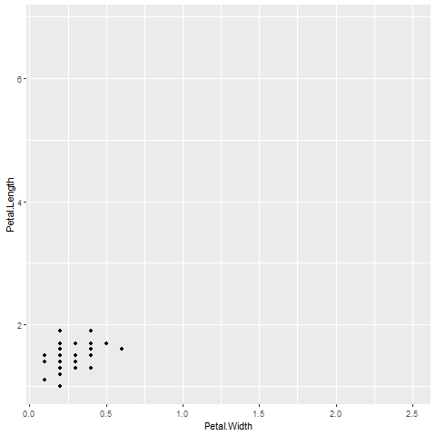

--- 
title: "Data Analysis"
author: "Brian Macdonald"
date: "Updated `r Sys.Date()`"
site: bookdown::bookdown_site
documentclass: book
bibliography: [book.bib, packages.bib]
url: https://bmacgtpm.github.io/book/
# cover-image: path to the social sharing image like images/cover.jpg
description: |
  Course notes for Data Analysis. 
link-citations: yes
github-repo: https://github.com/bmacGTPM/book
---

# Getting started

```{r, warning=F, message=F, echo=F, include=F}
knitr::opts_chunk$set(
  #class.source = "foldable", 
  class.source = "fold-show", 
  echo    = TRUE,      ## show or suppress the code
  include = TRUE ,     ## show or suppress the output
  message = FALSE,     ## omit messages generated by code
  warning = FALSE,     ## omit warnings generated by code
  comment = NA,        ## removes the ## from in front of outputs
  error   = F,         ## stop on errors
  results = 'hold'     ## wait to print results until after the code chunk
  #cache=T,            ## cache time consuming code
  #fig.align="center", ## centers all figures
  #fig.height = 5,     ## set the default height
  #fig.weight = 5      ## set the default width
  )

```

These are course notes for S&DS 361 Data Analysis. 

**Prerequisites.** It is assumed you have had a introductory course in probability and statistics, have some experience with R, linear regression, and matrix algebra. 

**Errors.** If you notice any errors in these notes, please submit a [pull request](https://github.com/bmacGTPM/notes/pulls). 

**Data.** The data used in these notes can be found at https://github.com/bmacGTPM/notes/tree/main/data.

## Software installation

### Download R

Download the latest version of R. You can do this in a couple of ways. 

- Download the latest version of R from https://cran.r-project.org/. This will not copy over your old packages. So you might want to try one of the next two approaches instead. 
- **Windows only**: use the `installr` package by running these lines of code. This will help you copy old packages over to your new version of R if you have a Windows machine.

```
install.packages("installr")
library(installr)
updateR()
```

It will say that "It is best to run this from the Rgui and not from RStudio. Would you like to abort the installation and run it again from Rgui?" I say yes. Then I go to `C:\Program Files\R\R-x.x.x\bin\x64` (my latest version of R) and double click on `Rgui.exe`. Then I run the code again. 

After it installs, it will ask if you want to copy your packages from your old version of R. I say yes. Then it asks if you want to keep the packages in your old version of R. I say yes again. I say yes to the question about Rprofile and yes to the question about updating packages. 

The copying of packages to the old version of R to the new version sometimes doesn't work. If that happens, you can running this function. 

```
installr::copy.packages.between.libraries()
```

If that doesn't work, you can try to copy the packages manually by going to the library folder of your old version of R (e.g. `C:\Program Files\R\R-4.3.1\library`) and copying the folders of the packages you want to the library folder of your new version of R (e.g. `C:\Program Files\R\R-4.3.3\library`). Newly installed packages might be instead by in a user-specific folder (e.g. `C:\Users\USERNAME\AppData\Local\R\win-library\4.3`) by default. In that case, those should be copied into the new folder. 

The updating of packages sometimes doesn't work either.  You can use `update.packages()` to update all packages, or `update.packages(ask = FALSE)` to update all packages without asking for permission.

- **Mac only**: use `updateR` package by running these lines of code. This will help you copy old packages over to your new version of R if you have a Mac.

```
install.packages("devtools")
devtools::install_github("AndreaCirilloAC/updateR")
library(updateR)
update()
```

After installing the newest version of R, restart R Studio. R Studio should automatically detect the new version of R, especially if you update R Studio as well (see below). If it doesn't automatically detect the new version of R, you can go to Tools, Global Options, General, and change the version of R that R Studio uses to the one you just installed. 

This code will show your version of R when you knit the document. It should say `r R.Version()$version.string`.

```{r}
R.Version()$version.string
```

### Download R Studio

Download the latest version of R Studio. Go to Help, Check for Updates. Or, go to https://posit.co/download/rstudio-desktop/. Note that you will see "Posit" in a lot of places. RStudio changed their name to Posit.

This code will show your version of R when you knit the document. 

```{r eval=F}
rstudioapi::versionInfo()$long_version
```

Recommended Settings: 

- Tools -> Global Options - General. Uncheck "Restore .RData into workspace at startup". Make sure "Save workspace to .RData on exit" is set to "Never". You will rarely/never want to save your workspace. If you write reproducible code, you won't need to save your workspace. You can reproduce the same results if you restart R/RStudio. If there are any outputs in particular you would like to save (e.g. because it takes a really long time to run), you can save individual objects using `saveRDS` or `write.csv`, or groups of objects with `save`. You can write these in your reproducible code. If for some reason you need to save the entire workspace, you can use `save.image`. However, I have literally never done this. 
- If you prefer dark mode, Tools -> Global Options -> Appearance -> Editor Theme = Tomorrow Night Bright (or some other dark theme of your choice)


### Install/update packages

Here are packages we'll definitely use. Install these now. We will likely use others as well but we'll have to install those on the fly as we need them. 

I recommend closing all R Studio windows except one, and restart R. Then install all packages listed here.


```
install.packages("tidyverse")
install.packages("knitr")
install.packages("plotly")
install.packages("scales")
install.packages("DT")
install.packages("leaflet")
install.packages('terra')
install.packages("gganimate")
install.packages('gifski')
install.packages('png')
install.packages("corrplot")
install.packages("GGally")
install.packages("ggmap")
install.packages("shiny")
install.packages("MASS")
install.packages("lme4")
install.packages("arm")
install.packages("pROC")
install.packages("MLmetrics")
install.packages("viridis")
install.packages("RSelenium")
install.packages("rvest")
install.packages("randomForest")
install.packages("devtools")
install.packages("splines")
install.packages("RecordLinkage")
install.packages("ff")
install.packages("rsconnect")
install.packages('grid')
install.packages('foreign')
install.packages('maps')
install.packages('timeDate')
install.packages('tidycensus')
install.packages('pscl')

## Install packages from my GitHub
devtools::install_github("bmacGTPM/pubtheme")
```


If you get errors you don't understand, try installing them one by one. 

If you get any sort of "permission denied" errors when trying to install the packages, you can try going to the folder with the library (e.g. `C:\Program Files\R\R-4.2.2\library`), delete the folder, and then install the packages again. For me, this happens often with `rlang` and `htmltools`. 

If it seems to freeze at the statement "There are binary versions available but the source versions are later:" check for a small window that opened but hidden behind other windows, with the question "Do you want to install from sources the packages that needs compilation?" Say yes. If you get an error with any of these, you can try saying no. 

Check that you can load all of the libraries by running this chunk of code and showing that it executes without error. There may be some messages, and maybe warnings about versions. Those are ok.

```{r error=T}
library(knitr)
library(scales)
library(DT)
library(leaflet) ## might need to comment out
library(terra)   ## might need to comment out
library(gganimate)
library(gifski)
library(png)
library(corrplot)
library(GGally)
library(ggmap)
library(shiny)
library(MASS)
library(lme4)
library(arm)
library(pROC)
library(MLmetrics)
library(viridis)
library(RSelenium)
library(rvest)
library(randomForest, exclude = 'margin')
library(FNN)
library(caret)
library(pls)
library(devtools)
library(splines)
library(RecordLinkage)
library(ff)
library(rsconnect)
library(grid)
library(foreign)
library(maps) ## leave uncommented. For some reason GitHub Actions had a problem when this wasn't explicitly loaded here. 
library(timeDate)
library(tidycensus) ## might need to comment


## load tidyverse last!
library(tidyverse)
library(plotly)
library(pubtheme)
```

### Check `gganimate`

Let's create a really quick animation that appears in the  `gganimate` introduction. First a static (non-animated) plot. 

```{r}
library(gganimate)

# We'll start with a static plot
g = ggplot(iris, 
            aes(x = Petal.Width, 
                y = Petal.Length)) + 
  geom_point() 
g
```

That should give a static plot. The following code should give an animation. 

```
a = g + 
  transition_states(Species,
                    transition_length = 2,
                    state_length = 1)
a
```
That should ideally show an animation in the Viewer in R Studio. The default location of the view is a tabs in the lower right window. 

If it looks like R starts saving several image files to your computer, make sure that the package `gifski` is installed and that `library(gifski)` doesn't give any errors. 

This should save the animation `a` as an animated `.gif` file. 

```
anim_save(a, 
          filename = 'img/test.gif')
```
It should be in the same folder as this R Markdown file. If that works, `gganimate` is good to go!




### Github

- Create a GitHub account at <https://github.com/> if you don't have one.
- Download GitHub Desktop at <https://desktop.github.com/>.


## Other preparation 

### Bookmarks

Bookmark these pages: 

- These notes https://bmacgtpm.github.io/notes/ 
- The Github page for these notes https://github.com/bmacGTPM/notes. If you want to work with the R Markdown versions of these notes, you can find them in that GitHub repo. You can also ask questions, and create pull requests to add content or fix typos. In the main folder, there are several Rmd files:

    - `index.Rmd`. This is the first Rmd file and corresponds to the first section of the Notes https://bmacgtpm.github.io/notes/
    - All other `Rmd` files are numbered and appear in the Notes in the same order as the `Rmd` files. For example, the `Rmd` files for the `dplyr` and `ggplot` sections in the Appendix are 
    
        - `99-01-appendix-dplyr.Rmd`
        - `99-02-appendix-ggplot.Rmd`
        
- The `pubtheme` Github page https://github.com/bmacGTPM/pubtheme
- These books
    - Beyond Multiple Linear Regression https://bookdown.org/roback/bookdown-BeyondMLR/
    - Regression and Other Stories https://avehtari.github.io/ROS-Examples/
    - Introduction to Statistical Learning https://www.statlearning.com/
- These resources
    - [R for Data Science](https://r4ds.had.co.nz/)
    - [Advanced R](https://adv-r.hadley.nz/)
    - [R Markdown: The Definitive Guide](https://bookdown.org/yihui/rmarkdown/)
    - The [RStudio cheatsheets](https://rstudio.com/resources/cheatsheets/)


### Backing up work

Most of your coding should take place in a source file or R Markdown file. Very little coding should occur in the console. This will make it far easier to reproduce what you did and back up your work.

There are a couple of options for backing up your work

- Use a cloud service like OneDrive, Google Drive, Dropbox, Box, iCloud, or use Time Machine, to automatically back up your files. 
- If you are using Git/Github as part of your typical workflow (recommended), you'll have a copy of your code in the "cloud" every time you push to Github. 
- Manually backup your files to an external hard drive on a regular basis. 

### Test code often

Test your code by running your script or knitting your R Markdown file often. This will help you catch errors early and it will likely make it easier to troubleshoot the errors. 

### dplyr and ggplot2
If you are unfamiliar with `tidyverse` and specifically the packages `dplyr` and `ggplot2`, there are two sections in the Appendix that are quick intros of `dplyr` and `ggplot2`:

- https://bmacgtpm.github.io/notes/data-exploration-with-dplyr.html
- https://bmacgtpm.github.io/notes/data-visualization-with-ggplot.html

The end of those sections contain links to more in-depth resources.

### Minimal reproducible examples

When asking someone for help in an email, on Slack, on Github, on a discussion board (e.g. stackoverflow.com), etc., use a minimal reproducible example. 

- Minimal: Use as little code as necessary that still results in the error
- Reproducible: provide all code and data necessary so that someone can copy/paste and reproduce the problem on their own machine.  

A minimal reproducible example makes it easier for someone to help you, and makes it easier to troubleshoot your own code. It might help an LLM help you also (I haven't tried this yet).

Here is the Stack Overflow page on the topic: https://stackoverflow.com/help/minimal-reproducible-example

Here is an example. Suppose you are working on using game results data to create a schedule matrix and have this code:

```{r eval = F}
library(pubtheme)
library(scales)
library(tidyverse)

d = readRDS('data/games.rds')

dg = d %>% 
  filter(lg == 'nba', 
         season %in% 2022, 
         season.type == 'reg') %>%
  group_by(away, 
           home, 
           season) %>%
  summarise(games = n()) %>%
  ungroup() %>%
  complete(away, 
           home, 
           fill = list(games = 0))

head(dg)

title = "Number of Games Between Each Pair of Teams" 
g = ggplot(dg, 
           aes(x = home,
               y = away, 
               fill = games))+ 
  geom_tile(linewidth = 0.4, 
            show.legend = T, 
            color = pubdarkgray) + ## used char above so leg is discrete
  scale_fill_manual(values = c(pubbackgray, 
                               publightred, 
                               pubred)) +
  labs(title    = title,
       x = 'Home Team', 
       y = 'Away Team')

g %>%
  pub(type = 'grid') +
  theme(axis.text.x.top = element_text(angle = 90, 
                                       vjust = .5,
                                       hjust = 0))


```

This results in the error `Error: Continuous value supplied to discrete scale`. Suppose we want help on this error. If the person we are asking has the `games.rds` data, then we can start stripping down the `ggplot` code as much as possible until we still have the error. Most lines of code can be removed because they are unrelated to the error. You can start commenting out one line at a time. This still gives the same error:

```{r eval = F}
title = "Number of Games Between Each Pair of Teams" 
g = ggplot(dg, 
           aes(x = home, 
               y = away, 
               fill = games))+ 
  geom_tile(linewidth = 0.4, 
            show.legend = T, 
            color = pubdarkgray) + 
  scale_fill_manual(values = c(pubbackgray, 
                               publightred, 
                               pubred)) #+
  # labs(title    = title,
  #      x = 'Home Team', 
  #      y = 'Away Team')  
  
# g %>%
#   pub(type = 'grid') +
#   theme(axis.text.x.top = element_text(angle = 90, 
#                                        vjust = .5,
#                                        hjust = 0))

g
```

So we can delete those lines of code. If we remove `scale_fill_manual` the error goes away, so we have to keep that in. 

```{r eval = F}
g = ggplot(dg, 
           aes(x = home, 
               y = away, 
               fill = games))+ 
  geom_tile(linewidth = 0.4, 
            show.legend = T, 
            color = pubdarkgray) + 
  scale_fill_manual(values = c(pubbackgray, 
                               publightred, 
                               pubred)) 
g
```
 We can also try getting rid of some of the arguments, like `linewidth`, `show.legend`, `color`, and we still get the error. Also, we can change the colors `pubbackgray`, `publightred`, and `pubred` to `'gray`', `'lightpink'`, and `'red'` which come with `R` and don't require the `pubtheme` package. 

```{r eval = F}
g = ggplot(dg, 
           aes(x = home, 
               y = away, 
               fill = games))+ 
  geom_tile() + 
  scale_fill_manual(values = c('gray', 
                               'lightpink', 
                               'red')) 
g
```

That is about all we can remove and still get the error. So if the person we are asking the question to has this data, they can copy/paste this code to their own computer and reproduce the error. 

If the person we are asking doesn't have the data, then we should use a widely available data set. The `mtcars` data is available to anyone with `R` and can be used here. 

```{r}
head(mtcars)
```

```{r eval = F}
library(tidyverse) 
dg = mtcars %>%
  group_by(cyl, vs) %>%
  summarise(mpg = mean(mpg), 
            .groups = 'keep')
head(dg)

g = ggplot(dg, aes(x = cyl, 
                   y = vs,
                   fill = mpg))+ 
  geom_tile() + 
  scale_fill_manual(values = c('gray', 
                               'lightpink', 
                               'red'))
g
```

Anyone, regardless of whether they have your data set, can copy/paste this code to diagnose. They will hopefully notice that `mpg`, the variable chosen to `fill` by, is continuous, while `scale_fill_manual` applies to discrete color scales. You'd have to use a continuous color scale with the continuous variable `mpg`. Something like this works: 

```{r}
library(tidyverse) 
dg = mtcars %>%
  group_by(cyl, vs) %>%
  summarise(mpg = mean(mpg), 
            .groups = 'keep')
head(dg)

g = ggplot(dg, 
           aes(x = cyl, 
               y = vs, 
               fill = mpg))+ 
  geom_tile() + 
  scale_fill_gradient(low = 'gray', 
                      high = 'red')
g
```

Now that we know how we can fix the error, let's go back to our original plot and replace `scale_fill_manual` with `scale_fill_gradient`. 

```{r fig.height = 7, fig.width = 7}
d = readRDS('data/games.rds')

dg = d %>% 
  filter(lg == 'nba', 
         season %in% 2022, 
         season.type == 'reg') %>%
  group_by(away, 
           home, 
           season) %>%
  summarise(games = n()) %>%
  ungroup() %>%
  complete(away, 
           home, 
           fill = list(games = 0))
head(dg)

title = "Number of Games Between Each Pair of Teams" 
g = ggplot(dg, 
           aes(x = home, 
               y = away, 
               fill = games))+ 
  geom_tile(linewidth = 0.4, 
            show.legend = T, 
            color = pubdarkgray) + 
  scale_fill_gradient(low = pubbackgray, 
                      high = pubred) +
  labs(title    = title,
       x = 'Home Team', 
       y = 'Away Team')

g %>%
  pub(type = 'grid') +
  theme(axis.text.x.top = element_text(angle = 90, 
                                       vjust = .5, 
                                       hjust = 0))

```

Another option would have been to convert `games` to a character or factor and keep `scale_fill_manual`. 


```{r fig.height = 7, fig.width = 7}
dg = dg %>%
  mutate(games = as.character(games))

title = "Number of Games Between Each Pair of Teams" 
g = ggplot(dg, 
           aes(x = home, 
               y = away, 
               fill = games))+ 
  geom_tile(linewidth = 0.4, 
            show.legend = T, 
            color = pubdarkgray) + ## used char above so leg is discrete
  scale_fill_manual(values = c(pubbackgray, 
                               publightred, 
                               pubred)) +
  labs(title    = title,
       x = 'Home Team', 
       y = 'Away Team')

g %>% 
  pub(type = 'grid') +
  theme(axis.text.x.top = element_text(angle = 90, 
                                       vjust = .5, 
                                       hjust = 0))
```


## Learning Objectives

In these notes we will

- **Ask interesting questions and develop a strategy to answer those questions using data.** This might seem like the easy part, but can often be the hardest part. 
- **Build comfort with coding and working hands-on with data.**  You will explore, visualize and analyze data with R, and learn best practices for writing code that is organized and commented, and executes fully reproducible analysis. You will also gain experience producing production-ready code able to be run in automated overnight processes, as well as other tools that are useful for many industry jobs and that prepare you for conducting your own research.
- **Get experience with interactive data exploration and visualization,** including what questions you want to ask about the data, what aspects of the data you want to highlight in your visualizations, and how to implement your ideas in `R`. We'll focus on best practices in planning visualizations, sketching them by hand, and creating them using `ggplot`, `plotly`, `leaflet`, `gganimate`, and other visualization packages. We'll create static, interactive, and animated visualizations and we'll develop interactive web apps using `shiny`. 
- **Learn statistical modeling with regression, generlized linear models, mixed effects regression and other topics**, like harmonic regression, regularization methods, maximum likelihood, splines, Monte Carlo simulation, resampling methods, model selection, variable selection, model diagnostics. We will focus on getting hands-on experience with determining what question we want to ask about the data, brainstorming the most appropriate approach(es) to answering the question, implementing those approaches in R, and assessing and interpreting the results of the analysis. We'll build the theoretical understanding that is necessary to appropriately apply these techniques as well. 

In short, you will gain experience in all aspects of the data analysis workflow, 

1. Defining the problem, question, or goal
2. Choosing data, acquiring data, assessing the quality of that data
3. Cleaning and wrangling data
4. Exploring and visualizing data
5. Analyzing data and building predictive models 
6. Interpreting, visualizing, and communicating the results
7. Developing recommended courses-of-action

although we'll focus more on #1, #4, #5, and #6 than on the others. 

## Coding conventions

We mostly/loosely follow the `tidyverse` [style guide](https://style.tidyverse.org/) with a couple exceptions. The primary purpose of these exceptions is to speed up typing by eliminating characters or reducing the need to use the Shift key. Sorry `tidyverse` style guide team! 

### Exception: We'll use `=` not `<-` for assignments
Most R coders use `<-` for object assignment (e.g. `x <- 2` to store `2` as the object `x`). We will use the equals sign (e.g. `x=2`) because it is faster to type, it is similar to what is used in Python, MATLAB, and Julia, and will be equivalent to `<-` in almost all situations. When they are not equivalent, we'll resort to using `<-`. 

One situation when `<-` works and `=` doesn't involves trying to make an assignment when calling another function. 

```
tryCatch(x =  runif(1))  # Fails. It interprets x as an argument of tryCatch
tryCatch(x <- runif(1))  # Works
summary(lm1 =  lm(mpg ~ wt, mtcars)) ## Fails. It thinks lm1 is an argument of summary
summary(lm1 <- lm(mpg ~ wt, mtcars)) ## Works.
```

We will rarely try to make assignments like that anyway. Instead, we'll do things like

``` 
x=runif(1)
tryCatch(x)

lm1 = lm(mpg ~ wt, mtcars)
summary(lm1)
```
In rare cases, we may not be able to avoid it, in which case we'll use `<-`. 

You can of course feel free to use `<-` when you are coding, but we won't typically be using it in these notes.

### Exception: We'll use `.` more than `_` for names
The style guide recommends using `_` instead of `.` in function names, column names, etc. (e.g. `first_name` instead of `first.name`, `add_row()` instead of `add.row()`). We'll use both, but we will more often use `.` because it is faster to type.

At times we'll probably be a little lazy with some of the conventions in the style guide but we'll do our best. 

